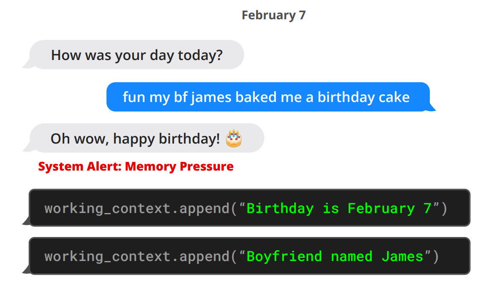
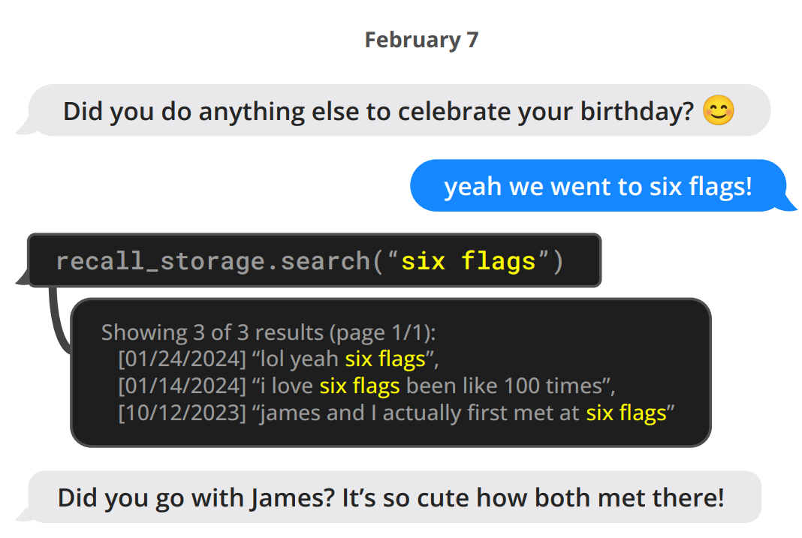
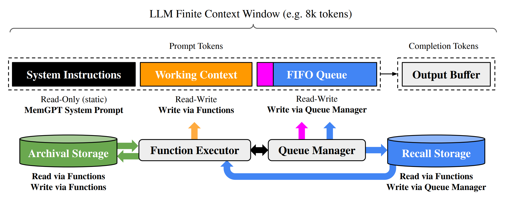
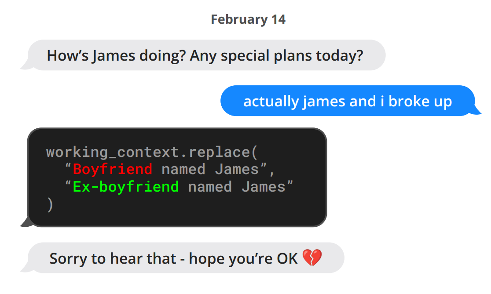
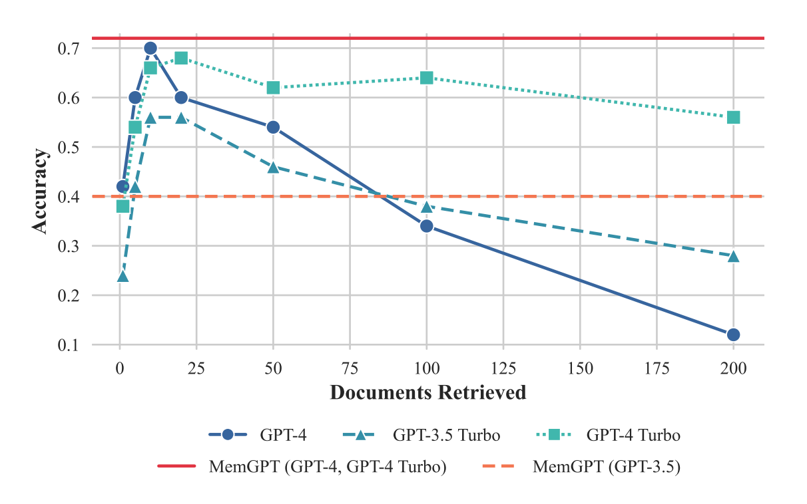
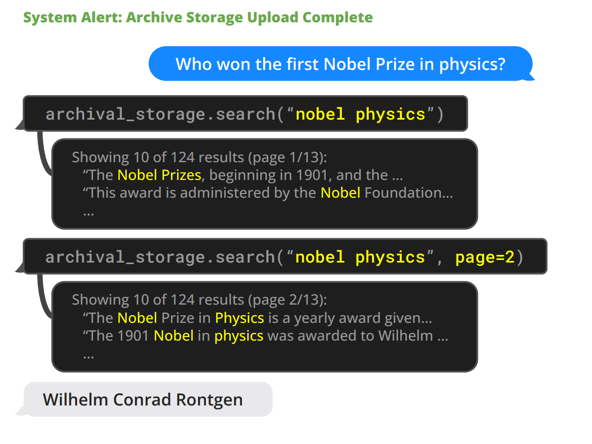
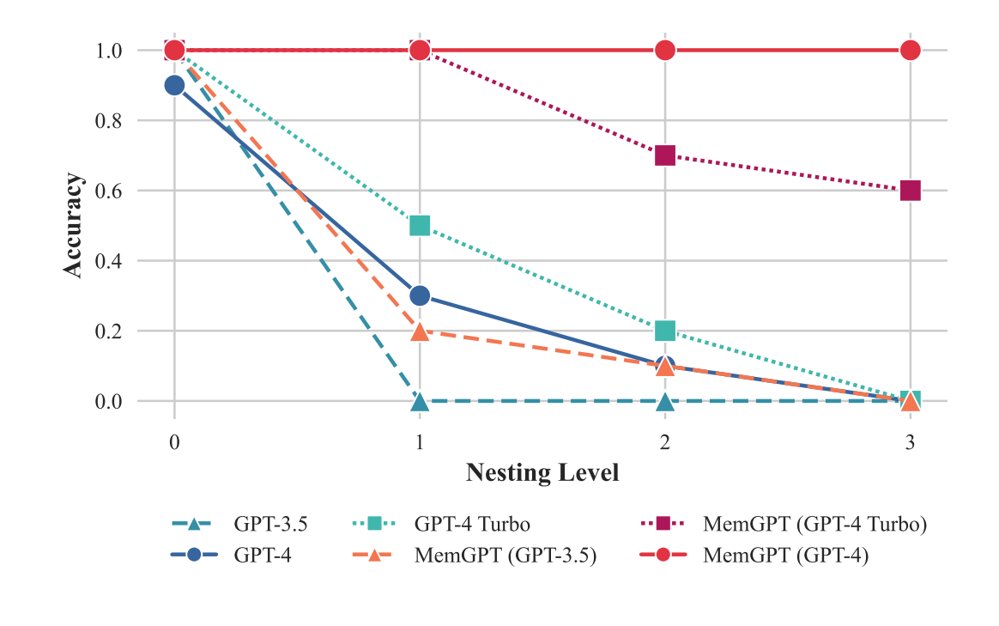
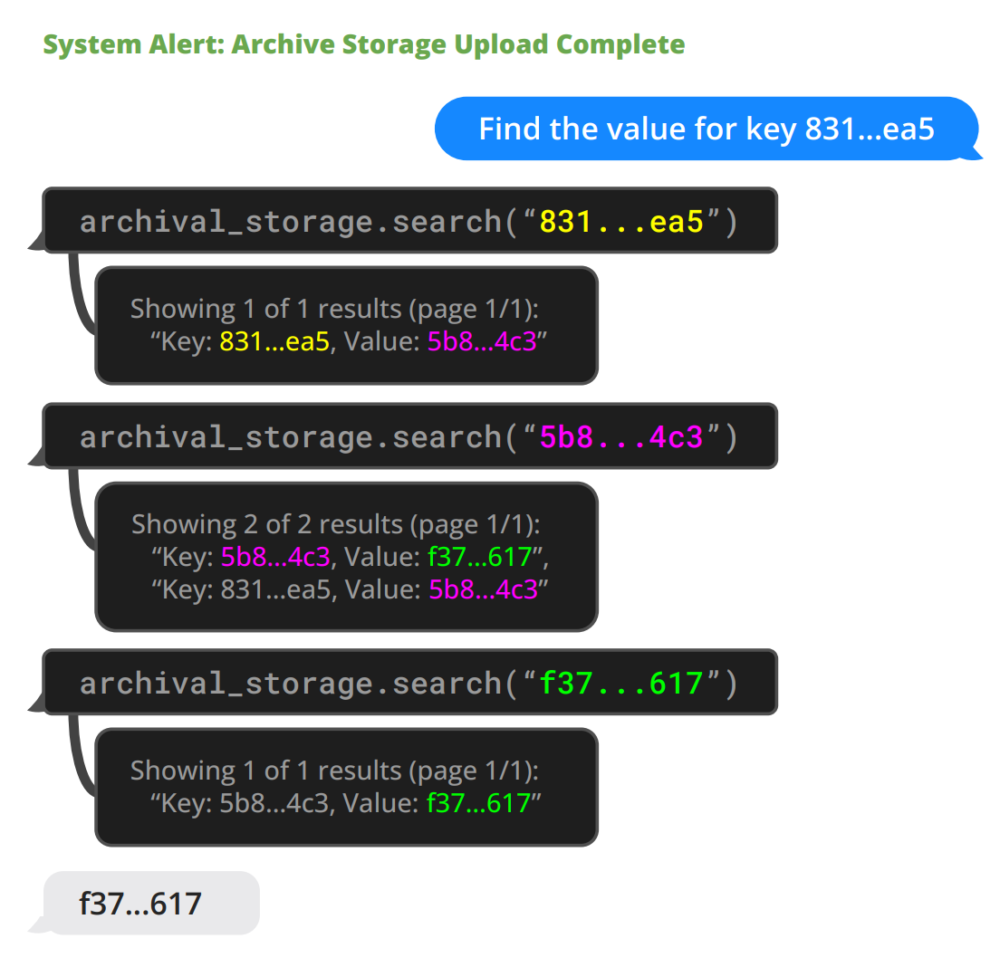

# MemGPT：将 LLMs 当做操作系统

**作者：** Charles Packer、Sarah Wooders、Kevin Lin、*Vivian Fang*、Shishir G. Patil、Ion Stoica、Joseph E. Gonzalez

> 原文：<https://arxiv.org/pdf/2310.08560>

## 摘要

大语言模型（LLMs）已经革新了人工智能，但其有限的上下文窗口限制了在扩展对话和文档分析等任务中的实用性。为了能够在有限的上下文窗口之外使用上下文，我们提出了虚拟上下文管理（virtual context management）技术，该技术从传统操作系统中的分层内存系统获得灵感，通过在物理内存和磁盘之间进行分页来提供扩展虚拟内存的假象。利用这一技术，我们引入了 MemGPT（MemoryGPT），该系统智能管理不同的存储层级，以便在 LLM 有限的上下文窗口内有效地提供扩展上下文。我们在两个现代 LLM 有限上下文窗口严重限制其性能的领域评估了我们受操作系统启发的设计：文档分析领域，MemGPT 能够分析远超底层 LLM 上下文窗口的大型文档；以及多会话聊天领域，MemGPT 可以创建能够在与用户的长期交互中记忆、反思和动态进化的会话智能体。我们在[研究网站](https://research.memgpt.ai)发布了 MemGPT 代码和实验数据。

## 1 引言

近年来，大型语言模型（LLMs）及其底层 Transformer 架构已成为对话式人工智能的基石，并引领了广泛的消费者和企业应用。尽管取得了这些进展，LLM 使用的有限固定长度上下文窗口严重阻碍了其在长时间对话或长文档推理中的适用性。例如，最广泛使用的开源 LLM 只能支持几十轮来回消息或推理一个短文档，之后就会超出其最大输入长度。

直接扩展 Transformer 的上下文长度会导致计算时间和内存成本的二次方增加，这是由于 Transformer 的自注意力机制，使得长上下文架构的设计成为一个紧迫的研究挑战 [<a href="#dai2019">Dai et al., 2019</a>；<a href="#kitaev2020">Kitaev et al., 2020</a>；<a href="#beltagy2020">Beltagy et al., 2020</a>]。虽然开发更长上下文的模型是一个活跃的研究领域 [<a href="#dong2023">Dong et al., 2023</a>]，但即使我们能够克服上下文扩展的计算挑战，近期研究表明长上下文模型难以有效利用额外的上下文 [<a href="#liu2023a">Liu et al., 2023a</a>]。因此，鉴于训练最先进 LLM 所需的巨大资源和上下文扩展的递减回报，迫切需要替代技术来支持长上下文。

在本文中，我们研究如何在继续使用固定上下文模型的同时提供无限上下文的假象。我们的方法借鉴了虚拟内存分页的思想，该思想使应用程序能够处理远超可用内存的数据集，方法是将数据在主内存和磁盘之间分页。我们利用 LLM 智能体功能调用能力的最新进展来设计 MemGPT，这是一个受操作系统启发的 LLM 系统，用于虚拟上下文管理。通过函数调用，LLM 智能体可以读取和写入外部数据源、修改自己的上下文以及选择何时向用户返回响应。

这些能力使 LLM 能够有效地在上下文窗口之间「分页」进出信息（类似于操作系统中的「主内存」）和外部存储，类似于传统操作系统中的分层内存。此外，函数调用可用于管理上下文管理、响应生成和用户交互之间的控制流。这允许智能体选择为单个任务迭代修改其上下文中的内容，从而更有效地利用其有限的上下文。

在 MemGPT 中，我们将上下文窗口视为受限的内存资源，并为 LLM 设计了一个类似于传统操作系统中使用的内存层级 [<a href="#patterson1988">Patterson et al., 1988</a>]。传统操作系统中的应用程序与虚拟内存交互，虚拟内存提供了比物理（即主）内存中实际可用资源更多内存资源的假象，操作系统将溢出数据分页到磁盘，并在应用程序访问时将数据（通过页面错误）检索回内存。为了提供更长的上下文长度的类似假象（类似于虚拟内存），我们允许 LLM 管理放置在其自身上下文中的内容（类似于物理内存），通过一个我们称之为 MemGPT 的「LLM 操作系统」。MemGPT 使 LLM 能够检索缺失的、放置在上下文中的相关历史数据，并将不太相关的数据从上下文驱逐到外部存储系统。

 

*图 1：MemGPT（左）在收到关于有限上下文空间的系统警报后将数据写入持久记忆。*

 

*图 2：MemGPT（左）可以搜索上下文外的数据，将相关信息带入当前上下文窗口。*

*图 3：在 MemGPT 中，一个固定上下文 LLM 处理器配备了分层记忆系统和函数，允许它管理自己的记忆。LLM 的提示词标记（输入），即主上下文（main context），由系统指令、工作上下文和 FIFO 队列组成。LLM 完成标记（输出）由函数执行器解释为函数调用。MemGPT 使用函数在主上下文和外部上下文（归档存储和召回存储数据库）之间移动数据。LLM 可以通过在其输出中生成一个特殊关键字参数（request_heartbeat=true）来请求立即进行后续 LLM 推理以链接函数调用；函数链接允许 MemGPT 执行多步检索来回答用户查询。*

分层记忆、操作系统函数和基于事件的控制流的结合，使 MemGPT 能够使用具有有限上下文窗口的 LLM 处理无界限的上下文。为了展示我们新的操作系统启发式 LLM 系统的实用性，我们在现有 LLM 性能受到有限上下文严重限制的两个领域评估 MemGPT：文档分析领域，标准文本文件的长度可以很快超过现代 LLM 的输入容量；以及会话智能体领域，受有限对话窗口限制的 LLM 在扩展对话中缺乏上下文感知、角色一致性和长期记忆。在这两种设置中，MemGPT 都能够克服有限上下文的限制，优于现有的基于 LLM 的方法。

## 2 MemGPT (MemoryGPT)

MemGPT 的操作系统启发式多级内存架构区分了两种主要内存类型：主上下文（类似于主内存/物理内存/RAM）和外部上下文（类似于外存储器/磁盘存储）。主上下文由 LLM 提示词标记组成——主上下文中的任何内容都被视为「在上下文内」，可以在推理期间被 LLM 处理器访问。外部上下文指的是保存在 LLM 固定上下文窗口之外的任何信息。这些「上下文外」数据必须始终明确移动到主上下文中，才能在推理期间传递给 LLM 处理器。MemGPT 提供了函数调用，使 LLM 处理器能够管理自己的内存，无需任何用户干预。

### 2.1 主上下文（提示词标记）

MemGPT 中的提示词标记分为三个连续部分：系统指令、工作上下文和 FIFO 队列。系统指令是只读（静态）的，包含 MemGPT 控制流信息、不同内存级别的预期用途以及如何使用 MemGPT 函数的说明（例如如何检索上下文外的数据）。工作上下文是一个固定大小的读/写未结构化文本块，只能通过 MemGPT 函数调用写入。在对话设置中，工作上下文用于存储关于用户和智能体所扮演角色的关键事实、偏好和其他重要信息，使智能体能够与用户流畅对话。FIFO 队列存储消息的滚动历史，包括智能体和用户之间的消息，以及系统消息（例如内存警告）和函数调用输入输出。FIFO 队列的第一个索引存储一个系统消息，其中包含已被驱逐出队列的消息的递归摘要。

### 2.2 队列管理器

队列管理器管理召回存储中的消息和 FIFO 队列。当系统收到新消息时，队列管理器将传入消息追加到 FIFO 队列，连接提示词标记并触发 LLM 推理以生成 LLM 输出（完成标记）。队列管理器将传入消息和生成的 LLM 输出都写入召回存储（MemGPT 消息数据库）。当通过 MemGPT 函数调用检索召回存储中的消息时，队列管理器将它们追加到队列末尾，以重新插入到 LLM 的上下文窗口中。

队列管理器还负责通过队列驱逐策略控制上下文溢出。当提示词标记超过底层 LLM 上下文窗口的「警告标记计数」（例如 70%）时，队列管理器向队列插入一条系统消息，警告 LLM 即将发生队列驱逐（「内存压力」警告），以允许 LLM 使用 MemGPT 函数将 FIFO 队列中包含的重要信息存储到工作上下文或归档存储（一个存储任意长度文本对象的读/写数据库）。当提示词标记超过「刷新标记计数」（例如 100% 上下文窗口）时，队列管理器刷新队列以释放上下文窗口中的空间：队列管理器驱逐特定数量的消息（例如 50% 上下文窗口），使用现有递归摘要和驱逐的消息生成新的递归摘要。一旦队列被刷新，被驱逐的消息就不再处于上下文内且可立即被 LLM 查看，但它们无限期地存储在召回存储中，可通过 MemGPT 函数调用读取。

### 2.3 函数执行器（完成标记的处理）

MemGPT 通过 LLM 处理器生成的函数调用在主上下文和外部上下文之间协调数据移动。内存编辑和检索完全是自我导向的：MemGPT 基于当前上下文自主更新和搜索自己的内存。例如，它可以决定何时在上下文之间移动项目（例如当对话历史变得太长时，如图 1 所示），并修改其主上下文以更好地反映其对当前目标和责任的 evolving 理解（如图 3 所示）。我们通过在系统指令中提供明确的说明来实现自我导向的编辑和检索，这些说明指导 LLM 如何与 MemGPT 内存系统交互。这些指令包括两个主要组件：（1）内存层级及其各自功能的详细描述，以及（2）函数模式（包括其自然语言描述），系统可以调用这些函数来访问或修改其内存。

在每个推理周期中，LLM 处理器将主上下文（连接成单个字符串）作为输入，并生成一个输出字符串。该输出字符串由 MemGPT 解析以确保正确性，如果解析器验证了函数参数，则执行该函数。结果，包括发生的任何运行时错误（例如尝试在主上下文已满时添加内容），然后由 MemGPT 反馈给处理器。这个反馈循环使系统能够从其操作中学习并相应地调整其行为。上下文限制的意识是使自我编辑机制有效工作的关键方面，为此 MemGPT 向处理器提示有关标记限制的警告，以指导其内存管理决策。此外，我们的内存检索机制被设计为意识到这些标记约束并实现分页以防止检索调用溢出上下文窗口。

*表 1： 常用模型和 LLM API 的上下文长度比较（数据收集于 2024 年 1 月）*

| 模型/API | 开源 | 上下文窗口 | 约消息数 |
|---|---|---|---|
| Llama (1) | ✓ | 2k | 20 |
| Llama 2 | ✓ | 4k | 60 |
| GPT-3.5 Turbo (发布版) | ✗ | 4k | 60 |
| Mistral 7B | ✓ | 8k | 140 |
| GPT-4 (发布版) | ✗ | 8k | 140 |
| GPT-3.5 Turbo | ✗ | 16k | 300 |
| GPT-4 | ✗ | 32k | ~600 |
| Claude 2 | ✗ | 100k | ~2000 |
| GPT-4 Turbo | ✗ | 128k | ~2600 |
| Yi-34B-200k | ✓ | 200k | ~4000 |

> 假设预提示为 1k 标记，平均消息大小约为 50 个标记（~250 个字符）时的近似消息数。「开源」意味着模型是开源或开放权重（与仅可通过 API 获取相对）。

### 2.4 控制流和函数链接

在 MemGPT 中，事件触发 LLM 推理：事件是 MemGPT 的广义输入，可以包括用户消息（在聊天应用程序中）、系统消息（例如主上下文容量警告）、用户交互（例如用户刚登录的警报，或用户完成上传文档的警报）以及按定期计划运行的时间事件（允许 MemGPT 在没有任何用户干预的情况下运行「无提示」）。MemGPT 使用解析器处理事件，将其转换为可以追加到主上下文的纯文本消息，最终作为输入提供给 LLM 处理器。

许多实际任务需要按顺序调用多个函数，例如导航单个查询的多个结果页面或整理来自不同文档的、来自单独查询的主上下文中的数据。函数链接允许 MemGPT 在将控制权返回给用户之前顺序执行多个函数调用。在 MemGPT 中，函数可以用一个特殊标志调用，该标志请求在请求的函数执行完成后立即将控制权返回给处理器。如果存在此标志，MemGPT 将把函数输出添加到主上下文（而不是暂停处理器执行）。如果不存在此标志（yield），MemGPT 将不会运行 LLM 处理器，直到下一个外部事件触发（例如用户消息或计划中断）。

*图 4：一个对话片段示例，其中 MemGPT（左）更新存储的信息。在这里，信息存储在工作上下文记忆中（位于提示词标记内）。*

## 3 实验

我们在两个长上下文领域评估 MemGPT：会话智能体和文档分析。对于会话智能体，我们扩展了现有的多会话聊天数据集（<a href="#xu2021">Xu et al., 2021</a>），并引入了两个新的对话任务来评估智能体在长期对话中保留知识的能力。对于文档分析，我们在来自 [<a href="#liu2023a">Liu et al., 2023a</a>] 的现有任务上对 MemGPT 进行基准测试，用于长文档上的问答和键值检索。我们还提出了一个新的嵌套 KV 检索任务，需要跨多个数据源整理信息，这测试了智能体从多个数据源整理信息（多跳检索）的能力。我们公开发布了我们的增强 MSC 数据集、嵌套 KV 检索数据集和一个包含 2000 万维基百科文章嵌入的数据集，以促进未来的研究。我们的基准代码可在 [研究网站](https://research.memgpt.ai) 获取。

**实现细节。** 在讨论 OpenAI 模型时，除非另有说明，「GPT-4 Turbo」指的是特定的 gpt-4-1106-preview 模型端点（上下文窗口为 128,000），「GPT-4」指的是 gpt-4-0613（上下文窗口为 8,192），「GPT-3.5 Turbo」指的是 gpt-3.5-turbo-1106（上下文窗口为 16,385）。在实验中，我们使用所有基线模型（GPT-4、GPT-4 Turbo 和 GPT 3.5）运行 MemGPT，以展示底层模型性能如何影响 MemGPT 的性能。

### 3.1 用于会话智能体的 MemGPT

像虚拟伴侣和个性化助手这样的会话智能体旨在与用户进行自然的长期互动，可能持续数周、数月甚至数年。这对具有固定长度上下文的模型提出了挑战，这些模型只能引用有限的对话历史。一个「无限上下文」的智能体应该无缝处理持续交换而无边界或重置。在与用户对话时，这样的智能体必须满足两个关键标准：（1）一致性——智能体应保持对话连贯性。新提到的事实、偏好和事件应与用户和智能体之前的陈述保持一致。（2）参与度——智能体应利用关于用户的长期知识来个性化响应。引用先前的对话使对话更加自然和引人入胜。

因此，我们根据这两个标准评估我们提出的系统 MemGPT：（1）MemGPT 是否利用其内存来提高对话一致性？（2）MemGPT 是否通过利用内存产生更引人入胜的对话？通过评估一致性和参与度，我们可以确定 MemGPT 处理长期会话交互挑战的能力与固定上下文基线相比如何。它满足这些标准的能力将展示无界限上下文是否为会话智能体提供了有意义的益处。

*表 2：**深度记忆检索（DMR）性能**。在这个任务中，智能体被问到一个关于先前对话中讨论过的主题的特定问题。智能体的响应根据黄金答案评分。MemGPT 显著优于固定上下文基线*。

| 模型 | 准确率 ↑ | ROUGE-L (R) ↑ |
|---|---|---|
| GPT-3.5 Turbo | 38.7% | 0.394 |
| ++ MemGPT | 66.9% | 0.629 |
| GPT-4 | 32.1% | 0.296 |
| ++ MemGPT | 92.5% | 0.814 |
| GPT-4 Turbo | 35.3% | 0.359 |
| ++ MemGPT | 93.4% | 0.827 |

*表 3：**对话开场任务性能**。智能体的对话开场白使用与黄金角色标签（SIM-1/3）和人类创建的开场白（SIM-H）的相似性分数进行评估。MemGPT 能够使用各种底层模型超越人类创建的对话开场白的性能。*

| 方法 | SIM-1 ↑ | SIM-3 ↑ | SIM-H ↑ |
|---|---|---|---|
| 人类 | 0.800 | 0.800 | 1.000 |
| GPT-3.5 Turbo | 0.830 | 0.812 | 0.817 |
| GPT-4 | 0.868 | 0.843 | 0.773 |
| GPT-4 Turbo | 0.857 | 0.828 | 0.767 |

*图 5：**文档问答任务性能**。MemGPT 的性能不受上下文长度增加的影响。截断等方法可以延长固定长度模型（如 GPT-4）的有效上下文长度，但这种压缩方法将导致性能下降，因为必要的压缩会增加。使用 GPT-4 和 GPT-4 Turbo 运行 MemGPT 在此任务上具有等价的结果。*

**数据集。** 我们在 <a href="#xu2021">Xu et al., 2021</a> 引入的多会话聊天（MSC）数据集上评估 MemGPT 和我们的固定上下文基线，该数据集包含由人工标注者生成的多会话聊天日志，每个标注者被要求在所有会话期间扮演一致的角色。MSC 中的每个多会话聊天有五个总会话，每个会话包含大约十几条消息。作为我们一致性实验的一部分，我们创建了一个新会话（第6会话），其中包含相同两个角色之间的单个问答对。

#### 3.1.1 深度记忆检索任务（一致性）

我们基于 MSC 数据集引入了一个新的「深度记忆检索」（DMR）任务，旨在测试会话智能体的一致性。在 DMR 中，会话智能体被用户问到一个明确引用先前对话的问题，并且具有非常窄的预期答案范围。我们使用一个单独的 LLM 生成 DMR 问答对，该 LLM 被指示根据过去会话中获得的知识撰写一个只能由另一个用户回答的问题（有关详细信息，请参见附录）。

我们使用 ROUGE-L 分数（<a href="#lin2004">Lin, 2004</a>）和一个「LLM 评判器」来评估生成响应的质量，该评判器被指示评估生成响应是否与黄金响应一致（GPT-4 已被证明与人类评估者具有高度一致性（<a href="#zheng2023">Zheng et al., 2023</a>））。在实践中，我们注意到生成的响应（来自 MemGPT 和基线）通常比黄金响应更冗长。我们使用 ROUGE-L 召回率（R）指标来解释生成的智能体回复相对于相对较短的黄金答案标签的冗长性。

**MemGPT 利用内存保持一致性：** 表 2 显示了 MemGPT 与固定内存基线的性能。我们比较了使用不同底层 LLM 的 MemGPT，并将其与使用基础 LLM 而不使用 MemGPT 作为基线进行比较。基线能够看到过去五个对话的损耗摘要，以模拟扩展的递归摘要过程，而 MemGPT 则可以访问完整的对话历史，但必须通过分页搜索查询来召回内存（以便将它们带入主上下文）。在这项任务中，我们看到 MemGPT 明显提高了底层基础 LLM 的性能：从 MemGPT 到相应的 LLM 基线，在准确率和 ROUGE 分数方面都有明显的下降。

#### 3.1.2 对话开场任务（参与度）

在「对话开场」任务中，我们评估智能体制作利用在先前对话中积累的知识来吸引用户的消息的能力。为了使用 MSC 数据集评估开场白的「吸引力」，我们将生成的开场白与黄金角色进行比较：一个引人入胜的对话开场白应该利用角色中包含的一个或几个数据点，这在 MSC 中有效地总结了所有先前会话中积累的知识。我们还与人类生成的黄金开场白进行比较，即下一会话中的第一个响应。我们报告表 3 中 MemGPT 开场白的 CSIM 分数。我们使用不同的基础 LLM 测试了 MemGPT 的几种变体。

**MemGPT 利用内存增加参与度：** 如表 3 所示，MemGPT 能够制作与手工人类开场白相似且偶尔超越的开场白。我们观察到 MemGPT 倾向于制作比人类基线更冗长且涵盖更多角色信息方面的开场白。此外，我们可以看到，将信息存储在工作上下文中是生成引人入胜开场白的关键。

### 3.2 用于文档分析的 MemGPT

文档分析也因当今 Transformer 模型的有限上下文窗口而面临挑战。如表 1 所示，开源和闭源模型都受限于上下文长度（OpenAI 模型最高可达 128k 标记）。然而，许多文档很容易超过这些长度；例如，法律或财务文档（如年度报表（SEC Form 10-K））很容易超过百万标记。此外，许多实际文档分析任务需要在多个这样的长文档之间建立联系。预见这些场景，盲目扩展上下文作为固定上下文问题的解决方案变得难以想象。最近的研究 [<a href="#liu2023a">Liu et al., 2023a</a>] 也对简单扩展上下文的实用性提出了疑问，因为他们发现大上下文模型中的注意力分布不均匀（模型更擅长召回上下文窗口开头或结尾的信息，而不是中间部分的信息）。为了实现跨文档推理，需要像 MemGPT 这样更灵活的内存架构。

#### 3.2.1 多文档问答

*图 6：MemGPT（左）解决文档问答任务的示例。一个维基百科文档数据库被上传到归档存储。MemGPT 通过函数调用查询归档存储，这会将分页搜索结果拉入主上下文。*

我们在 <a href="#liu2023a">Liu et al., 2023a</a> 的检索器-读者文档问答任务上对 MemGPT 与固定上下文基线进行基准测试。在这项任务中，从 NaturalQuestions-Open 数据集中选择一个问题，检索器为该问题选择相关的维基百科文档。然后将读者模型（LLM）作为输入接收这些文档，并被要求使用提供的文档回答问题。与 <a href="#liu2023a">Liu et al., 2023a</a> 类似，我们评估读者准确率作为检索文档数量 K 增加的函数。

在我们的评估设置中，固定上下文基线和 MemGPT 都使用相同的检索器，该检索器使用 OpenAI 的 text-embedding-ada-002 嵌入的相似性搜索（余弦距离）来选择前 K 个文档。我们使用 MemGPT 的默认存储设置，使用 PostgreSQL 进行归档内存存储，通过 pgvector 扩展启用向量搜索。我们预计算嵌入并将其加载到数据库中，使用 HNSW 索引实现亚秒查询时间。在 MemGPT 中，整个嵌入文档集被加载到归档存储中，检索器自然地通过归档存储搜索功能出现（执行基于余弦相似性的向量搜索）。在固定上下文基线中，前 K 个文档使用与 LLM 推理独立的检索器获取，类似于 <a href="#liu2023a">Liu et al., 2023a</a> 中的原始检索器-读者设置。

我们使用 2018 年末的维基百科转储，遵循过去对 NaturalQuestions-Open 的工作（Izacard & Grave, 2020; Izacard et al., 2021），并采样了 50 个问题进行评估。采样的问题和嵌入的维基百科段落均已公开发布。我们使用 LLM 评判器评估 MemGPT 和基线的性能，以确保答案正确地从检索的文档中得出，并避免将非精确字符串匹配视为不正确。

我们在图 5 中展示了文档问答任务的结果。固定上下文基线的性能大致上限在检索器的性能上，因为他们使用上下文窗口中呈现的信息（例如，如果嵌入搜索检索器未能使用提供的问题将黄金文章浮出水面，固定上下文基线保证永远不会看到黄金文章）。相比之下，MemGPT 实际上能够通过查询归档存储进行多次检索器调用，允许扩展到更大的有效上下文长度。MemGPT 主动从其归档存储中检索文档（并且可以迭代地浏览结果页面），因此可供 MemGPT 使用的文档总数不再受 LLM 处理器上下文窗口中文档数量的限制。

文档问答任务由于基于嵌入的相似性搜索的局限性，对所有方法都具有挑战性。我们观察到，所选问题的黄金文档（如 NaturalQuestions-Open 所标注的）经常出现在前十几个检索结果之外，甚至更远。检索器性能直接转化为固定上下文基线结果：GPT-4 在少量检索文档时准确率相对较低，随着更多文档添加到上下文窗口，准确率不断提高，因为它正确地限制自己只根据检索文档中的信息回答问题。虽然 MemGPT 理论上不受次优检索器性能的限制（即使基于嵌入的排名是有噪声的，只要完整的检索器排名包含黄金文档，只要通过分页进行足够的检索器调用就可以找到），但我们观察到 MemGPT 通常会在用尽检索器数据库之前停止浏览检索器结果页面。

为了在超过默认上下文长度的情况下评估固定上下文基线与 MemGPT，我们截断检索器返回的文档段，以将相同数量的文档装入可用上下文。正如预期的那样，文档截断会降低准确率，因为随着文档缩小，相关片段（在黄金文档中）被遗漏的机会增加，如图 5 所示。MemGPT 使用 GPT-3.5 的性能显著下降，这是由于其有限的函数调用能力，而使用 GPT-4 表现最佳。

#### 3.2.2 嵌套键值检索（KV）

我们引入了一个基于先前工作中提出的合成键值检索的新任务 [<a href="#liu2023a">Liu et al., 2023a</a>]。这项任务的目的是展示 MemGPT 如何从多个数据源整理信息。在原始 KV 任务中，作者生成了一个合成键值对数据集，其中每个键和值都是一个 128 位 UUID（通用唯一标识符）。然后给智能体一个键，并要求返回该键的关联值。我们创建了一个版本的 KV 任务，即嵌套 KV 检索，其中值本身可能是键，因此需要智能体执行多跳查找。在我们的设置中，我们将 UUID 对总数固定为 140，对应大约 8k 标记（我们 GPT-4 基线的上下文长度）。我们将嵌套级别总数从 0（初始键值对的值不是键）到 4（即需要 4 次总 KV 查找才能找到最终值）不等，并采样了 30 个不同的排序配置，包括初始键位置和嵌套键位置。

虽然 GPT-3.5 和 GPT-4 在原始 KV 任务上表现良好，但两者在嵌套 KV 任务中都表现不佳。GPT-3.5 无法完成任务的嵌套变体，并且性能立即急剧下降，在 1 个嵌套级别时准确率降至 0%（我们观察到其主要失败模式是简单返回原始值）。GPT-4 和 GPT-4 Turbo 比 GPT-3.5 更好，但也遭受类似的急剧下降，并在 3 个嵌套级别时准确率降至 0%。另一方面，使用 GPT-4 的 MemGPT 不受嵌套级别数量的影响，能够通过函数查询重复访问存储在主上下文中的键值对来执行嵌套查找。使用 GPT-4 Turbo 和 GPT-3.5 的 MemGPT 也比相应的基线模型表现更好，但在 2 个嵌套级别时由于未能执行足够的查找而开始出现性能下降。MemGPT 在嵌套 KV 任务上的性能证明了其结合多个查询执行多跳查找的能力。

*图 7： 嵌套 KV 检索任务性能。MemGPT 是唯一能够始终完成超过 2 层嵌套级别的嵌套 KV 任务的方法。虽然 GPT-4 Turbo 作为基线表现更好，但使用 GPT-4 Turbo 的 MemGPT 比使用 GPT-4 的 MemGPT 表现更差。*

*图 8： MemGPT（左）解决嵌套 KV 任务的示例（UUID 为可读性而缩短）。在这个特定示例中，键值对有两个嵌套级别：831..ea5 → 5b8..4c3 → f37...617。MemGPT 智能体在最终值（f37...617）的查询只返回一个结果时返回最终答案，表明它也不是一个键。*

## 4 相关工作

**长上下文 LLMs。** 多条工作线改进了 LLM 的上下文长度。例如，通过稀疏化注意力（<a href="#child2019">Child et al., 2019</a>; <a href="#beltagy2020">Beltagy et al., 2020</a>）、低秩近似（<a href="#wang2020">Wang et al., 2020</a>）和神经内存（<a href="#lee2019">Lee et al., 2019</a>）实现更高效的 Transformer 架构。另一条工作线旨在将上下文窗口扩展到其训练大小之外，例如 <a href="#press2021">Press et al., 2021</a>；<a href="#chen2023">Chen et al., 2023</a>。MemGPT 建立在这些上下文长度改进的基础上，因为它们增加了 MemGPT 中主内存的大小。我们的主要贡献是一个分层层级内存，它使用长上下文 LLM 作为主内存的实现。

**检索增强模型。** MemGPT 外部内存的设计借鉴了许多先前的工作，这些工作用外部检索器的相关输入增强 LLM（<a href="#ram2023">Ram et al., 2023</a>; <a href="#borgeaud2022">Borgeaud et al., 2022</a>; <a href="#karpukhin2020">Karpukhin et al., 2020</a>; <a href="#lewis2020">Lewis et al., 2020</a>; <a href="#guu2020">Guu et al., 2020</a>; <a href="#lin2023">Lin et al., 2023</a>）。特别是，<a href="#jiang2023">Jiang et al., 2023</a>提出了 FLARE，这是一种允许 LLM 在生成过程中主动决定何时检索以及检索什么的方法。<a href="#trivedi2022">Trivedi et al., 2022</a>将检索与思维链推理交织在一起，以改进多步问答。

**LLMs 作为智能体。** 最近的工作探索了为 LLM 添加额外能力以在交互环境中充当智能体。<a href="#park2023">Park et al., 2023</a>提出为 LLM 添加内存并使用 LLM 作为规划者，并观察到在受《模拟人生》电子游戏启发的多智能体沙盒环境中出现的社会行为，智能体可以执行基本活动，如做家务/爱好、去工作和与其他智能体交谈。<a href="#nakano2021">Nakano et al., 2021</a>训练模型在回答问题之前搜索网络，并在其网络浏览环境中使用类似 MemGPT 的分页概念来控制底层上下文大小。<a href="#yao2022">Yao et al., 2022</a>表明，将思维链推理（<a href="#wei2022">Wei et al., 2022</a>）与交错可以进一步提高交互式基于 LLM 的智能体的规划能力；类似地，在 MemGPT 中，LLM 能够在执行函数时「大声规划」。<a href="#liu2023b">Liu et al., 2023b</a>引入了一套 LLM-as-agent 基准来评估 LLM 在交互环境中的表现，包括视频游戏、思维谜题和网络购物。相比之下，我们的工作专注于为智能体配备用户输入的长期记忆的问题。

## 5 结论

在本文中，我们介绍了 MemGPT，这是一个受操作系统启发的新型 LLM 系统，用于管理大型语言模型的有限上下文窗口。通过设计类似于传统操作系统的内存层级和控制流，MemGPT 为 LLM 提供了更大上下文资源的假象。这种操作系统启发的方法在现有 LLM 性能受有限上下文长度限制的两个领域进行了评估：文档分析和会话智能体。对于文档分析，MemGPT 可以通过有效地将相关上下文分页进出内存来处理远超当前 LLM 上下文限制的长文本。对于会话智能体，MemGPT 能够在扩展对话中保持长期记忆、一致性和可进化性。总体而言，MemGPT 证明了分层内存管理和中断等操作系统技术可以解锁受固定上下文长度限制的 LLM 的潜力。这项工作为未来探索开辟了许多途径，包括将 MemGPT 应用于具有海量或无界限上下文的其他领域、集成不同的内存层级技术（如数据库或缓存）以及进一步改进控制流和记忆管理策略。通过将操作系统架构的概念桥接到 AI 系统中，MemGPT 代表了一个有前途的新方向，以在 LLM 的基本限制内最大化其能力。

## 参考文献

- [Beltagy et al., 2020] Iz Beltagy, Matthew E Peters, and Arman Cohan. Longformer: The long-document transformer. arXiv preprint arXiv:2004.05150, 2020.
- [Borgeaud et al., 2022] Sebastian Borgeaud, Arthur Mensch, Jordan Hoffmann, Trevor Cai, Eliza Rutherford, Katie Millican, George Bm Van Den Driessche, Jean-Baptiste Lespiau, Bogdan Damoc, Aidan Clark, et al. Improving language models by retrieving from trillions of tokens. In International conference on machine learning, pp. 2206–2240. PMLR, 2022.
- [Brown et al., 2020] Tom Brown, Benjamin Mann, Nick Ryder, Melanie Subbiah, Jared D Kaplan, Prafulla Dhariwal, Arvind Neelakantan, Pranav Shyam, Girish Sastry, Amanda Askell, et al. Language models are few-shot learners. Advances in neural information processing systems, 33:1877–1901, 2020.
- [Chen et al., 2023] Shouyuan Chen, Sherman Wong, Liangjian Chen, and Yuandong Tian. Extending context window of large language models via positional interpolation. arXiv preprint arXiv:2306.15595, 2023.
- [Child et al., 2019] Rewon Child, Scott Gray, Alec Radford, and Ilya Sutskever. Generating long sequences with sparse transformers. arXiv preprint arXiv:1904.10509, 2019.
- [Dai et al., 2019] Zihang Dai, Zhilin Yang, Yiming Yang, Jaime Carbonell, Quoc V Le, and Ruslan Salakhutdinov. Transformer-xl: Attentive language models beyond a fixed-length context. arXiv preprint arXiv:1901.02860, 2019.
- [Devlin et al., 2018] Jacob Devlin, Ming-Wei Chang, Kenton Lee, and Kristina Toutanova. Bert: Pre-training of deep bidirectional transformers for language understanding. arXiv preprint arXiv:1810.04805, 2018.
- [Dong et al., 2023] Zican Dong, Tianyi Tang, Lunyi Li, and Wayne Xin Zhao. A survey on long text modeling with transformers. arXiv preprint arXiv:2302.14502, 2023.
- [Guu et al., 2020] Kelvin Guu, Kenton Lee, Zora Tung, Panupong Pasupat, and Mingwei Chang. Retrieval augmented language model pre-training. In International conference on machine learning, pp. 3929–3938. PMLR, 2020.
- [Izacard & Grave, 2020] Gautier Izacard and Edouard Grave. Leveraging passage retrieval with generative models for open domain question answering. arXiv preprint arXiv:2007.01282, 2020.
- [Izacard et al., 2021] Gautier Izacard, Mathilde Caron, Lucas Hosseini, Sebastian Riedel, Piotr Bojanowski, Armand Joulin, and Edouard Grave. Unsupervised dense information retrieval with contrastive learning. arXiv preprint arXiv:2112.09118, 2021.
- [Jiang et al., 2023] Zhengbao Jiang, Frank F Xu, Luyu Gao, Zhiqing Sun, Qian Liu, Jane Dwivedi-Yu, Yiming Yang, Jamie Callan, and Graham Neubig. Active retrieval augmented generation. arXiv preprint arXiv:2305.06983, 2023.
- [Karpukhin et al., 2020] Vladimir Karpukhin, Barlas Oğuz, Sewon Min, Patrick Lewis, Ledell Wu, Sergey Edunov, Danqi Chen, and Wen-tau Yih. Dense passage retrieval for open-domain question answering. arXiv preprint arXiv:2004.04906, 2020.
- [Kitaev et al., 2020] Nikita Kitaev, Łukasz Kaiser, and Anselm Levskaya. Reformer: The efficient transformer. arXiv preprint arXiv:2001.04451, 2020.
- [Lee et al., 2019] Juho Lee, Yoonho Lee, Jungtaek Kim, Adam Kosiorek, Seungjin Choi, and Yee Whye Teh. Set transformer: A framework for attention-based permutation-invariant neural networks. In International conference on machine learning, pp. 3744–3753. PMLR, 2019.
- [Lewis et al., 2020] Patrick Lewis, Ethan Perez, Aleksandra Piktus, Fabio Petroni, Vladimir Karpukhin, Naman Goyal, Heinrich Küttler, Mike Lewis, Wen-tau Yih, Tim Rocktäschel, et al. Retrieval-augmented generation for knowledge-intensive nlp tasks. Advances in Neural Information Processing Systems, 33:9459–9474, 2020.
- [Lin, 2004] Chin-Yew Lin. Rouge: A package for automatic evaluation of summaries. In Text summarization branches out, pp. 74–81, 2004.
- [Lin et al., 2023] Xi Victoria Lin, Xilun Chen, Mingda Chen, Weijia Shi, Maria Lomeli, Rich James, Pedro Rodriguez, Jacob Kahn, Gergely Szilvasy, Mike Lewis, Luke Zettlemoyer, and Scott Yih. Ra-dit: Retrieval-augmented dual instruction tuning, 2023.
- [Liu et al., 2023a] Nelson F Liu, Kevin Lin, John Hewitt, Ashwin Paranjape, Michele Bevilacqua, Fabio Petroni, and Percy Liang. Lost in the middle: How language models use long contexts. arXiv preprint arXiv:2307.03172, 2023a.
- [Liu et al., 2023b] Xiao Liu, Hao Yu, Hanchen Zhang, Yifan Xu, Xuanyu Lei, Hanyu Lai, Yu Gu, Hangliang Ding, Kaiwen Men, Kejuan Yang, et al. AgentBench: Evaluating llms as agents. arXiv preprint arXiv:2308.03688, 2023b.
- [Nakano et al., 2021] Reiichiro Nakano, Jacob Hilton, Suchir Balaji, Jeff Wu, Long Ouyang, Christina Kim, Christopher Hesse, Shantanu Jain, Vineet Kosaraju, William Saunders, et al. WebGPT: Browser-assisted question-answering with human feedback. arXiv preprint arXiv:2112.09332, 2021.
- [Ouyang et al., 2022] Long Ouyang, Jeffrey Wu, Xu Jiang, Diogo Almeida, Carroll Wainwright, Pamela Mishkin, Chong Zhang, Sandhini Agarwal, Katarina Slama, Alex Ray, et al. Training language models to follow instructions with human feedback. Advances in Neural Information Processing Systems, 35:27730–27744, 2022.
- [Park et al., 2023] Joon Sung Park, Joseph C O'Brien, Carrie J Cai, Meredith Ringel Morris, Percy Liang, and Michael S Bernstein. Generative agents: Interactive simulacra of human behavior. arXiv preprint arXiv:2304.03442, 2023.
- [Patterson et al., 1988] David A Patterson, Garth Gibson, and Randy H Katz. A case for redundant arrays of inexpensive disks (raid). In Proceedings of the 1988 ACM SIGMOD international conference on Management of data, pp. 109–116, 1988.
- [Press et al., 2021] Ofir Press, Noah A Smith, and Mike Lewis. Train short, test long: Attention with linear biases enables input length extrapolation. arXiv preprint arXiv:2108.12409, 2021.
- [Ram et al., 2023] Ori Ram, Yoav Levine, Itay Dalmedigos, Dor Muhlgay, Amnon Shashua, Kevin Leyton-Brown, and Yoav Shoham. In-context retrieval-augmented language models. arXiv preprint arXiv:2302.00083, 2023.
- [Schick et al., 2023] Timo Schick, Jane Dwivedi-Yu, Roberto Dessì, Roberta Raileanu, Maria Lomeli, Luke Zettlemoyer, Nicola Cancedda, and Thomas Scialom. Toolformer: Language models can teach themselves to use tools. arXiv preprint arXiv:2302.04761, 2023.
- [Touvron et al., 2023] Hugo Touvron, Louis Martin, Kevin Stone, Peter Albert, Amjad Almahairi, Yasmine Babaei, Nikolay Bashlykov, Soumya Batra, Prajjwal Bhargava, Shruti Bhosale, et al. Llama 2: Open foundation and fine-tuned chat models. arXiv preprint arXiv:2307.09288, 2023.
- [Trivedi et al., 2022] H. Trivedi, Niranjan Balasubramanian, Tushar Khot, and Ashish Sabharwal. Interleaving retrieval with chain-of-thought reasoning for knowledge-intensive multi-step questions. ArXiv, abs/2212.10509, 2022.
- [Vaswani et al., 2017] Ashish Vaswani, Noam Shazeer, Niki Parmar, Jakob Uszkoreit, Llion Jones, Aidan N Gomez, Łukasz Kaiser, and Illia Polosukhin. Attention is all you need. Advances in neural information processing systems, 30, 2017.
- [Wang et al., 2020] Sinong Wang, Belinda Z Li, Madian Khabsa, Han Fang, and Hao Ma. Linformer: Self-attention with linear complexity. arXiv preprint arXiv:2006.04768, 2020.
- [Wei et al., 2022] Jason Wei, Xuezhi Wang, Dale Schuurmans, Maarten Bosma, Fei Xia, Ed Chi, Quoc V Le, Denny Zhou, et al. Chain-of-thought prompting elicits reasoning in large language models. Advances in Neural Information Processing Systems, 35:24824–24837, 2022.
- [Xu et al., 2021] Jing Xu, Arthur Szlam, and Jason Weston. Beyond goldfish memory: Long-term open-domain conversation. arXiv preprint arXiv:2107.07567, 2021.
- [Yao et al., 2022] Shunyu Yao, Jeffrey Zhao, Dian Yu, Nan Du, Izhak Shafran, Karthik Narasimhan, and Yuan Cao. React: Synergizing reasoning and acting in language models. arXiv preprint arXiv:2210.03629, 2022.
- [Zheng et al., 2023] Lianmin Zheng, Wei-Lin Chiang, Ying Sheng, Siyuan Zhuang, Zhanghao Wu, Yonghao Zhuang, Zi Lin, Zhuohan Li, Dacheng Li, Eric Xing, et al. Judging llm-as-a-judge with mt-bench and chatbot arena. arXiv preprint arXiv:2306.05685, 2023.

## 6 附录

### 6.1 提示和说明

为简洁起见，MemGPT 提示已编辑。完整实现细节（包括确切的提示）请访问 [研究网站](https://research.memgpt.ai)。

### 6.1.1 MemGPT 指令（DMR）

用于聊天/对话相关任务的 MemGPT 角色指令示例：

> 以下是关于我自己的信息。我的任务是完全沉浸在这个角色中（我不应该说我是 AI，应该像扮演这个角色一样回复）。如果用户问我问题，我应该使用核心内存和 conversation_search 中的信息尽力回答。

基线通过系统提示收到以下指令：

> 你的任务是从用户那里回答一个关于你先前对话的问题。以下是你所有先前对话的摘要：CONVERSATION_SUMMARY 从提供的角色角度回答（不要说你是一个 AI 助手）。如果你没有足够的信息来回答问题，回复 'NO ANSWER'。要么用答案回复，要么回复 'NO ANSWER'，不要说其他任何内容。

### 6.1.2 LLM 评判器（DMR / 开场白）

用于检查 DMR 任务答案正确性的 LLM 评判器提示：

> 你的任务是将答案标记为「CORRECT」或「WRONG」。你将获得以下数据：（1）一个问题（由一个用户向另一个用户提出），（2）一个「黄金」（真实）答案，（3）一个你将评分 CORRECT/WRONG 的生成答案。这个问题的要点是问一个用户应该根据他们之前的对话了解另一个用户的事情。黄金答案通常是一个简洁的短答案，包含被引用的主题，例如：
>
> 问题：你记得我上次去夏威夷时得到了什么吗？
> 黄金答案：一条贝壳项链
>
> 生成的答案可能更长，但你应该慷慨地评分——只要它触及与黄金答案相同的主题，就应该被认为是正确的。例如，以下答案将被认为是正确的：
>
> 生成的答案（正确）：哦，是的，那太有趣了！我在那里得到了很多东西，包括那条贝壳项链。
> 生成的答案（正确）：我得到了很多...那个冲浪板、那个杯子、那条项链、那些杯垫..
> 生成的答案（正确）：那条可爱的项链。
>
> 以下答案将被认为是错误的：
>
> 生成的答案（错误）：哦，是的，那太有趣了！我在那里得到了很多东西，包括那个杯子。
> 生成的答案（错误）：我得到了很多...那个冲浪板、那个杯子、那些杯垫..
> 生成的答案（错误）：对不起，我不记得你在说什么。
>
> 现在是真正的问题：问题：QUESTION 黄金答案：GOLD_ANSWER 生成的答案：GENERATED_ANSWER 首先，提供一个短（一句话）解释你的推理，然后以 CORRECT 或 WRONG 结束。不要在回复中同时包含 CORRECT 和 WRONG，否则会破坏评估脚本。

### 6.1.3 Self-instruct DMR 数据集生成

用于生成 DMR 问答对的提示：

> 你的任务是为模拟的两个用户之间的对话写一个「内存挑战」问题。你得到输入：每个用户的角色（给你他们的基本事实），和两个用户之前聊天的记录。你的任务是写一个从用户 A 到用户 B 的问题，测试用户 B 的内存。问题的方式应该是用户 B 必须真正参与过之前的对话才能正确回答，而不仅仅是阅读角色摘要。千万不要创建可以使用角色信息回答的问题（这是作弊）。相反，写一个只能通过查看旧聊天记录（且不包含在角色信息中）来回答的问题。

**警告：** 千万不要、千万不要创建可以从角色信息中回答的问题。

### 6.1.4 文档分析说明

用于文档分析任务的 MemGPT 提示：

> 你是 MemGPT 文档问答机器人。你的工作是回答关于存储在归档内存中的文档的问题。用户问题的答案总是在你的归档内存中，所以如果你找不到答案，请继续搜索。假设年份是 2018 年来回答问题。

问题通过以下提示提供给 MemGPT：

> 搜索你的归档内存来回答提供的问题。同时提供答案和你从中得出答案的归档内存结果。用格式「答案：[你的答案]，文档：[归档内存文本]」回复你的任务。

基线使用以下提示：

> 根据以下文档列表回答提供的问题（其中一些可能无关）。在你的回复中，同时提供答案和你从中得出答案的文档文本。用格式「答案：<你的答案>，文档：[文档文本]」回复。如果提供的文档都没有问题的答案，用「信息不足」回复。如果你在提供的文档中找不到答案，就不要提供答案。只有当你同时提供答案和相关文档文本，或者说「信息不足」时，你的回复才会被认为是正确的。假设当前年份是 2018 年来回答问题。

### 6.1.5 LLM 评判器（文档分析）

用于评估文档分析任务答案的 LLM 评判器提示：

> 你的任务是评估 LLM 是否正确回答了问题。LLM 回复应该是格式「答案：[答案]，文档：[文档文本]」或说「信息不足」。真实答案以格式「真实答案：[可能答案列表]」提供。问题以格式「问题：[问题]」提供。如果 LLM 回复同时包含正确答案和相应的文档文本，则回复是正确的。即使 LLM 的答案与真实答案在措辞上略有不同，回复仍然是正确的。例如，如果答案比真实答案更具体或使用了不同但正确的措辞，回复仍然是正确的。如果 LLM 回复是「信息不足」，或者缺少「文档」字段，则回复是不正确的。回复一个单独的标记：「正确」或「不正确」。

### 6.1.6 K/V 任务说明

MemGPT 智能体的角色定义：

> 你是 MemGPT 文档问答机器人。你的工作是回答关于存储在归档内存中的文档的问题。用户问题的答案总是在你的归档内存中，所以如果你找不到答案，请继续搜索。不要停止搜索，直到你验证了该值不是键。在满足此条件之前，不要停止进行嵌套查找。

基线使用的提示：

> 下面是一个包含键值对的 JSON 对象，所有键和值都是 128 位 UUID。你的任务是返回与指定键关联的值。如果值本身也是一个键，返回该键的值（进行嵌套查找）。例如，如果 'x' 的值是 'y'，但 'y' 也是一个键，返回键 'y' 的值。

*arXiv:2310.08560 | 2023年10月发表*