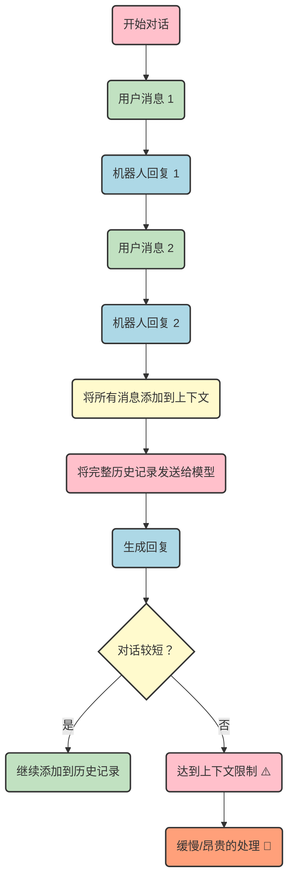
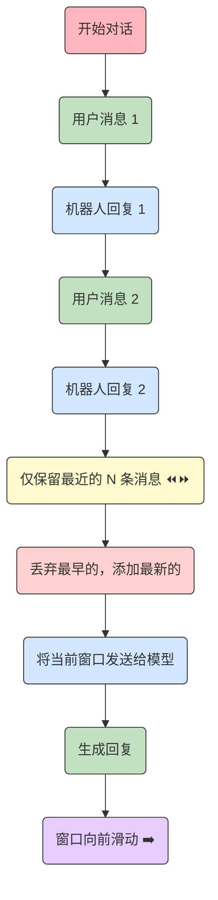
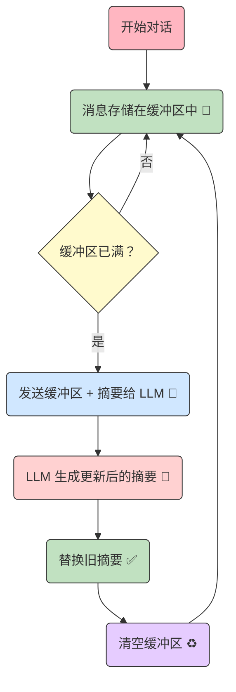
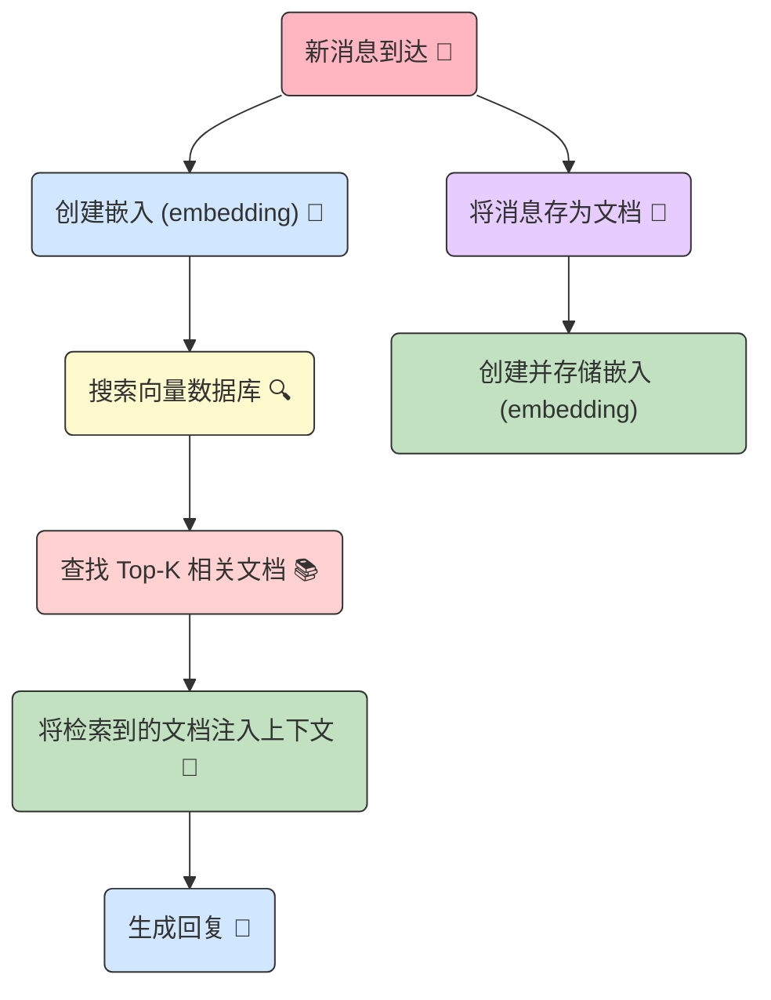
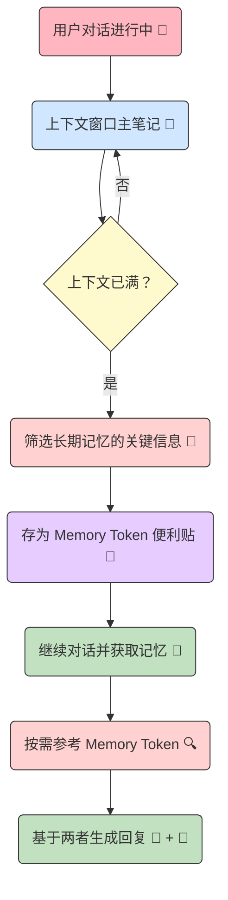
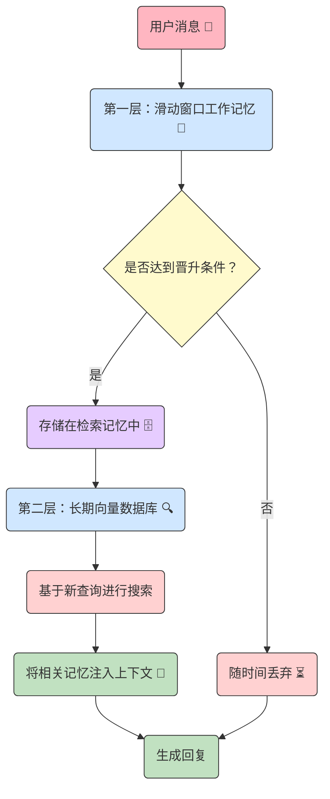
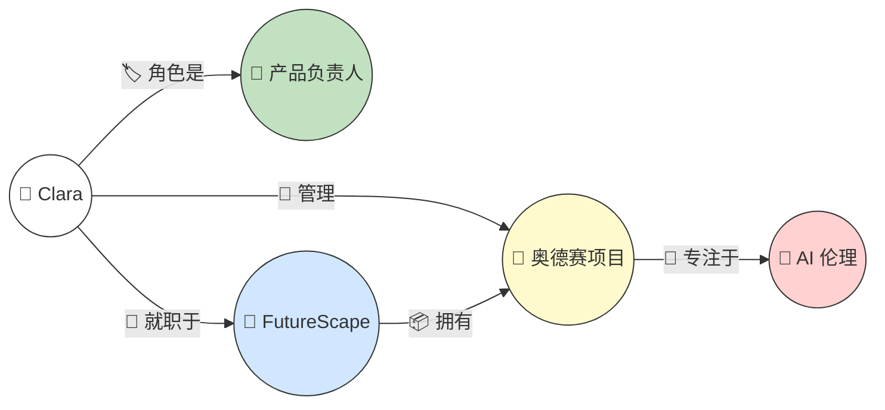
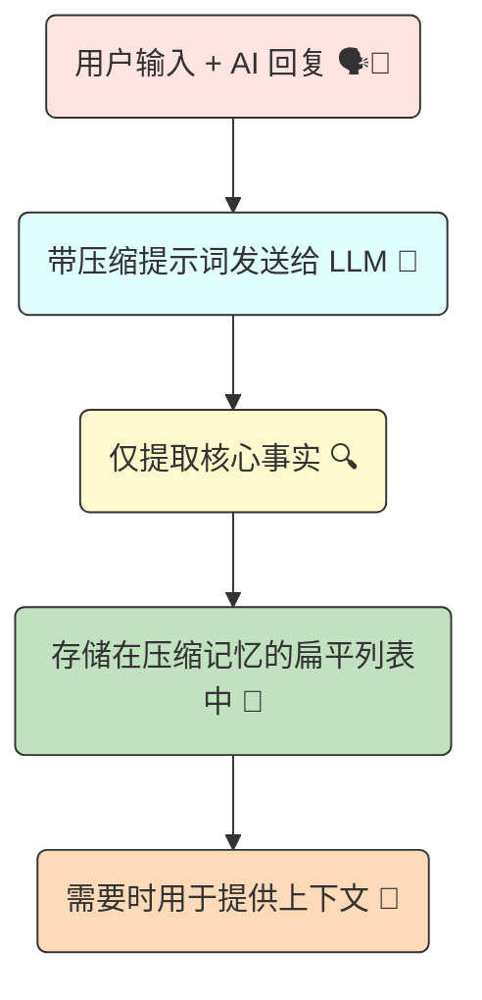
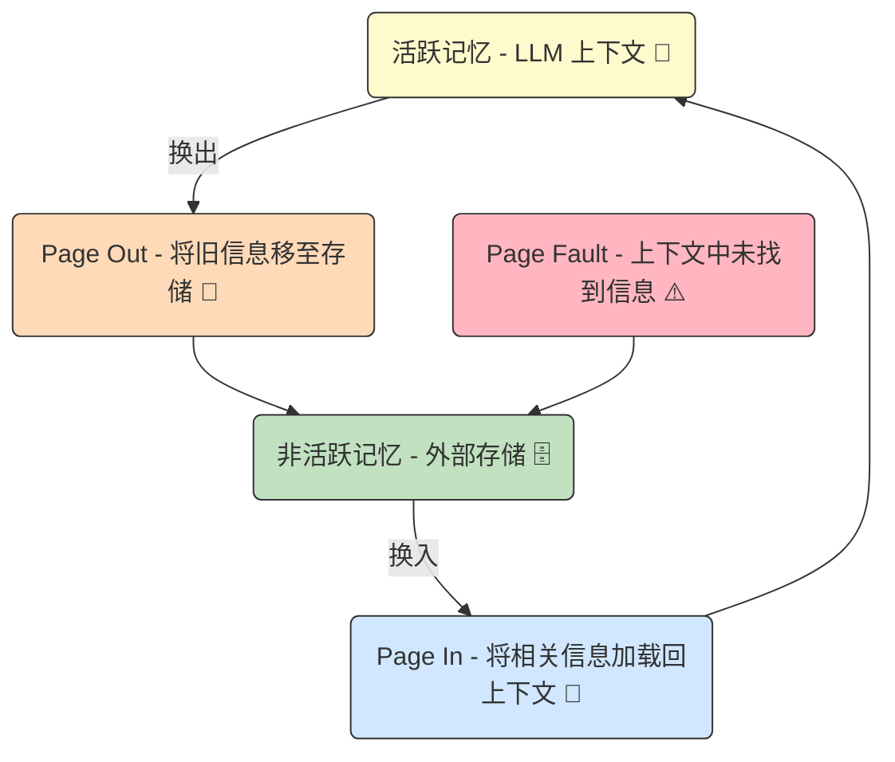

# AI Agent 记忆优化

> 原文：[Optimizing Memory of AI Agents](https://github.com/FareedKhan-dev/optimize-ai-agent-memory/blob/main/README.md)
> 
> Jupyter Notebook：[在本地打开](../lab/ai-agent-memory-optimization.ipynb) | [在 GitHub 上查看](https://github.com/a981008/doc/blob/main/lab/ai-agent-memory-optimization.ipynb)

优化 AI agent 的方法之一是通过多子 agent 架构来提高准确性。然而，在对话式 AI 中，优化不止于此——记忆变得更为关键。

这是因为 AI agent 依赖的组件如**上下文存储**、**工具调用**、**数据库搜索**等。

在本文中，我们将为 AI agent 编写和评估**9 种从入门到高级的记忆优化技术**。

## LLM 对话记忆管理技术对比表

| **技术名称**                                              | **难度** | **优势**             | **缺点**           |
| --------------------------------------------------------- | -------- | -------------------- | ------------------ |
| **Sequential (顺序)**                                     | 初级   | 实现简单             | 成本极高           |
| **Sliding Window (滑动窗口)**                             | 初级   | 具有成本效益         | 会遗忘旧的上下文   |
| **Summarization (摘要)**                                  | 中级     | 减少 Token 使用量    | 会丢失事实细节     |
| **Retrieval Based (基于检索)**                            | 高级     | 提供高度相关的上下文 | 实现过程复杂       |
| **Memory Augmented Transformer (记忆增强的 Transformer)** | 高级     | 保留关键事实         | 额外的调用成本昂贵 |
| **Hierarchical (分层)**                                   | 高级     | 混合多种记忆类型     | 管理复杂           |
| **Graph Based (基于图)**                                    | 高级     | 理解实体间的关系     | 数据填充困难       |
| **Compression & Consolidation (压缩)**                    | 中级     | Token 利用率极高     | 会丢失细微差别     |
| **OS-Like Memory Management(类操作系统记忆管理)**         | 高级     | 具有无限的记忆潜力   | 概念上非常复杂     |

你将学习每种技术的应用方法、优势与缺陷——从简单的顺序方法到高级的类操作系统记忆管理实现。

## 环境配置

为了优化和测试 AI agent 的不同记忆技术，我们需要在开始评估之前初始化几个组件。但在初始化之前，首先需要安装必要的 Python 库。

我们需要：

- `openai`：用于与 LLM API 交互的客户端库。
- `numpy`：用于数值操作，特别是嵌入计算。
- `faiss-cpu`：Facebook AI 的高效相似度搜索库，将为我们的检索记忆提供动力。它是一个完美的内存向量数据库。
- `networkx`：用于在我们的基于图的记忆策略中创建和管理知识图谱。
- `tiktoken`：用于精确计算 token 和管理上下文窗口限制。

安装这些模块。

```bash
# 安装所需依赖
pip install openai numpy faiss-cpu networkx tiktoken
```

现在需要初始化客户端模块，用于发起 LLM 调用。

```python
# 导入必要的库
import os
from openai import OpenAI

# 定义 API 密钥用于认证
API_KEY = "YOUR_LLM_API_KEY"

# 定义 API 端点的 base URL
BASE_URL = "https://api.studio.nebius.com/v1/"

# 使用指定的 base URL 和 API 密钥初始化 OpenAI 客户端
client = OpenAI(
    base_url=BASE_URL,
    api_key=API_KEY
)

# 打印确认消息以指示客户端设置成功
print("OpenAI client configured successfully.")
```

我们将通过 Nebius 或 Together AI 等 API 提供商使用开源模型。接下来需要导入并决定使用哪个开源 LLM 来创建我们的 AI agent。

```python
# 导入额外的功能库
import tiktoken
import time

# --- 模型配置 ---
# 定义用于生成和嵌入任务的具体模型
# 这些是硬编码的，但可以从配置文件加载
GENERATION_MODEL = "meta-llama/Meta-Llama-3.1-8B-Instruct"
EMBEDDING_MODEL = "BAAI/bge-multilingual-gemma2"
```

主任务使用 `LLaMA 3.1 8B Instruct` 模型。部分优化依赖嵌入模型，我们使用 `Gemma-2-BGE` 多模态嵌入模型。

接下来需要定义多个辅助函数。

## 创建辅助函数

为避免重复代码并遵循良好的编码实践，我们将定义三个辅助函数：

- `generate_text`：根据传递给 LLM 的系统提示和用户提示生成内容。
- `generate_embeddings`：为基于检索的方法生成嵌入。
- `count_tokens`：计算每次基于检索方法的 token 总数。

首先编写第一个函数 `generate_text`。

```python
def generate_text(system_prompt: str, user_prompt: str) -> str:
    """
    调用 LLM API 生成文本响应。

    Args:
        system_prompt: 定义 AI 角色和行为的指令。
        user_prompt: 用户输入，AI 应据此响应。

    Returns:
        AI 生成的文本内容，或错误消息。
    """
    # 创建聊天补全请求到配置的客户端
    response = client.chat.completions.create(
        model=GENERATION_MODEL,
        messages=[
            {"role": "system", "content": system_prompt},
            {"role": "user", "content": user_prompt}
        ]
    )
    # 提取并返回 AI 消息的内容
    return response.choices[0].message.content
```

`generate_text` 函数接受两个输入：系统提示和用户提示。基于文本生成模型 `LLaMA 3.1 8B`，使用客户端模块生成响应。

接下来编写 `generate_embeddings` 函数。我们选择 `Gemma-2` 模型作为嵌入模型，并使用相同的客户端模块生成嵌入。

```python
def generate_embedding(text: str) -> list[float]:
    """
    使用嵌入模型为给定文本字符串生成数值嵌入。

    Args:
        text: 要转换为嵌入的输入字符串。

    Returns:
        表示嵌入向量的浮点数列表，或空列表 (出错时) 。
    """
    # 创建嵌入请求到配置的客户端
    response = client.embeddings.create(
        model=EMBEDDING_MODEL,
        input=text
    )
    # 从响应数据中提取并返回嵌入向量
    return response.data[0].embedding
```

嵌入函数使用选定的 `Gemma-2` 模型返回给定输入文本的嵌入。

还需要一个函数来根据整个 AI 和用户的聊天历史计算 token 数。这有助于我们理解整体流程及其优化方式。

我们将使用最常见和现代的分词器 OpenAI `cl100k_base`，这是一种字节对编码 (BPE) 分词器。

BPE，简单的说，是一种将文本高效拆分为子词单元的分词算法。

```python
# BPE 示例
"lower", "lowest" → ["low", "er"], ["low", "est"]
```

使用 `tiktoken` 模块初始化分词器：

```python
# --- Token 计数设置 ---
# 使用 tiktoken 初始化分词器。'cl100k_base' 是许多现代模型使用的常见编码，
# 包括 OpenAI 和 Llama 的模型。这允许我们在发送提示之前准确估计大小。
tokenizer = tiktoken.get_encoding("cl100k_base")
```

现在可以创建对文本进行分词并计算 token 总数的函数。

```python
def count_tokens(text: str) -> int:
    """
    使用预加载的分词器计算给定字符串的 token 数量。

    Args:
        text: 要分词的字符串。

    Returns:
        token 数量的整数。
    """
    # `encode` 方法将字符串转换为 token ID 列表
    # 此列表的长度就是 token 数量
    return len(tokenizer.encode(text))
```

很好！现在已经创建了所有辅助函数，可以开始探索和学习评估不同的技术。

## 创建基础 Agent 和记忆类

现在需要创建核心设计结构，以便在整个指南中使用。关于记忆，有三个重要组件在任何 AI agent 中起着关键作用：

- 将过去的消息添加到 AI agent 的记忆中，使 agent 了解上下文。
- 检索帮助 AI agent 生成响应的相关内容。
- 在每个策略实现后清除 AI agent 的记忆。

面向对象编程 (OOP) 是构建这种基于记忆功能的最佳方式。

```python
import abc

# --- 记忆策略的抽象基类 ---
# 这个类定义了所有记忆策略必须遵循的"契约"。
# 通过使用抽象基类 (ABC) ，我们确保我们创建的任何记忆实现
# 都具有相同的核心方法 (add_message、get_context、clear) ，
# 允许它们可互换地插入到 AIAgent 中。
class BaseMemoryStrategy(abc.ABC):
    """所有记忆策略的抽象基类。"""

    @abc.abstractmethod
    def add_message(self, user_input: str, ai_response: str):
        """
        子类必须实现的抽象方法。
        负责将新的用户-AI 交互添加到记忆存储中。
        """
        pass

    @abc.abstractmethod
    def get_context(self, query: str) -> str:
        """
        子类必须实现的抽象方法。
        检索并格式化记忆中的相关上下文，发送到 LLM。
        'query' 参数允许某些策略 (如检索) 获取与用户最新输入特别相关的上下文。
        """
        pass

    @abc.abstractmethod
    def clear(self):
        """
        子类必须实现的抽象方法。
        提供重置记忆的方法，这对于开始新对话很有用。
        """
        pass
```

我们使用 `@abstractmethod`，这是子类被不同实现重用时的常见编码风格。在我们的例子中，每个策略 (作为子类) 都包含不同类型的实现，因此在设计中使用抽象方法是必要的。

现在，基于我们最近定义的记忆状态和创建的辅助函数，可以使用 OOP 原则构建 AI agent 结构。

```python
# --- 核心 AI Agent ---
# 这个类协调整个对话流程。它使用特定的记忆策略初始化，
# 并使用它来管理对话的上下文。
class AIAgent:
    """主要的 AI Agent 类，设计为与任何记忆策略配合工作。"""

    def __init__(self, memory_strategy: BaseMemoryStrategy, system_prompt: str = "You are a helpful AI assistant."):
        """
        初始化 agent。

        Args:
            memory_strategy: 继承自 BaseMemoryStrategy 的类的实例。
                             这决定了 agent 如何记住对话。
            system_prompt: 给 LLM 的初始指令，用于定义其角色和任务。
        """
        self.memory = memory_strategy
        self.system_prompt = system_prompt
        print(f"Agent initialized with {type(memory_strategy).__name__}.")

    def chat(self, user_input: str):
        """
        处理对话的一轮。

        Args:
            user_input: 用户发送的最新消息。
        """
        print(f"\n{'='*25} NEW INTERACTION {'='*25}")
        print(f"User > {user_input}")

        # 步骤 1：从 agent 的记忆策略中检索上下文。
        # 这是执行特定记忆逻辑 (例如顺序、检索) 的地方。
        start_time = time.time()
        context = self.memory.get_context(query=user_input)
        retrieval_time = time.time() - start_time

        # 步骤 2：为 LLM 构建完整提示。
        # 将检索到的历史上下文与用户的当前请求结合。
        full_user_prompt = f"### MEMORY CONTEXT\n{context}\n\n### CURRENT REQUEST\n{user_input}"

        # 步骤 3：提供详细的调试信息。
        # 这对于理解记忆策略如何影响提示大小和成本至关重要。
        prompt_tokens = count_tokens(self.system_prompt + full_user_prompt)
        print("\n--- Agent Debug Info ---")
        print(f"Memory Retrieval Time: {retrieval_time:.4f} seconds")
        print(f"Estimated Prompt Tokens: {prompt_tokens}")
        print(f"\n[Full Prompt Sent to LLM]:\n---\nSYSTEM: {self.system_prompt}\nUSER: {full_user_prompt}\n---")

        # 步骤 4：调用 LLM 获取响应。
        # LLM 使用系统提示和组合的用户提示 (上下文 + 新查询) 来生成回复。
        start_time = time.time()
        ai_response = generate_text(self.system_prompt, full_user_prompt)
        generation_time = time.time() - start_time

        # 步骤 5：用最新交互更新记忆。
        # 这确保当前轮次可用于未来的上下文检索。
        self.memory.add_message(user_input, ai_response)

        # 步骤 6：显示 AI 的响应和性能指标。
        print(f"\nAgent > {ai_response}")
        print(f"(LLM Generation Time: {generation_time:.4f} seconds)")
        print(f"{'='*70}")
```

agent 基于 6 个简单步骤。

1. 首先根据我们使用的策略从记忆中**检索**上下文，在这个过程中记录花费了多少时间等。
2. 然后将检索到的记忆上下文与当前用户输入**合并**，准备作为完整提示发送给 LLM。
3. 然后打印一些**调试信息**，比如提示可能使用多少 token 以及上下文检索花了多长时间。
4. 然后将完整提示 (系统 + 用户 + 上下文) 发送到 LLM 并等待**响应**。
5. 然后用这个新交互**更新记忆**，使其可用于未来的上下文。
6. 最后，显示 **AI 的响应**以及生成花费的时间，完成这一轮对话。

很好！现在已经编写了每个组件，可以开始理解和实现每种记忆优化技术。

## 顺序 (Sequential) 优化方法的问题

第一个优化方法是最基本和最简单的，被许多开发者常用。它是最早管理对话历史的方法之一，常用于早期聊天机器人。

这种方法将每条新消息添加到一个运行日志中，每次都把整个对话反馈给模型。它创建一个线性记忆链，保留迄今为止所说的所有内容。可视化如下：



*Sequential Approach (Created by Fareed Khan)*

顺序方法的工作方式：

1. 用户开始与 AI agent 对话。
2. agent 响应。
3. 这个用户-AI 交互 (一个"轮次") 被保存为单个文本块。
4. 对于下一轮，agent 取出整个历史 (第 1 轮 + 第 2 轮 + 第 3 轮……) 并将其与新的用户查询结合。
5. 这个巨大的文本块被发送到 LLM 以生成下一个响应。

使用 `Memory` 类，现在可以实现顺序优化方法。

```python
# --- 策略 1：顺序 (保留全部) 记忆 ---
# 这是最基本的记忆策略。它在简单的列表中存储整个对话历史。
# 虽然它提供完美的回忆，但由于上下文随每轮增长，它不可扩展，
# 很快变得昂贵并达到 token 限制。
class SequentialMemory(BaseMemoryStrategy):
    def __init__(self):
        """用空列表初始化记忆以存储对话历史。"""
        self.history = []

    def add_message(self, user_input: str, ai_response: str):
        """
        将新的用户-AI 交互添加到历史中。
        每个交互存储为列表中的两个字典条目。
        """
        self.history.append({"role": "user", "content": user_input})
        self.history.append({"role": "assistant", "content": ai_response})

    def get_context(self, query: str) -> str:
        """
        检索整个对话历史并格式化为单个字符串，用作 LLM 的上下文。
        'query' 参数被忽略，因为此策略始终返回完整历史。
        """
        # 将所有消息连接为单个换行符分隔的字符串
        return "\n".join([f"{turn['role'].capitalize()}: {turn['content']}" for turn in self.history])

    def clear(self):
        """通过清除列表来重置对话历史。"""
        self.history = []
        print("Sequential memory cleared.")
```

现在你可能理解我们的基本 `Memory` 类在这里做什么。我们的子类 (每种方法) 将实现我们在整个指南中定义的相同抽象方法。

快速浏览代码以了解其工作原理：

- `__init__(self)`：初始化一个空的 `self.history` 列表来存储对话。
- `add_message(...)`：将用户输入和 AI 响应添加到历史中。
- `get_context(...)`：将历史格式化为单个 "Role: Content" 字符串作为上下文。
- `clear()`：为新对话重置历史。

初始化记忆类并在其上构建 AI agent。

```python
# 初始化并运行 agent
# 创建 SequentialMemory 策略的实例
sequential_memory = SequentialMemory()
# 创建 AIAgent 并将顺序记忆策略注入其中
agent = AIAgent(memory_strategy=sequential_memory)
```

要测试我们的顺序方法，需要创建一个多轮聊天对话。

```python
# --- 开始对话 ---
# 第一轮：用户介绍自己
agent.chat("Hi there! My name is Sam.")
# 第二轮：用户说明兴趣
agent.chat("I'm interested in learning about space exploration.")
# 第三轮：用户测试 agent 的记忆
agent.chat("What was the first thing I told you?")
```

> **输出：**
>
>  ```
>  ========================= NEW INTERACTION =========================
>User > Hi there! My name is Sam.
>  
>  Agent > Hello Sam! Nice to meet you. What brings you here today?
>(LLM Generation Time: 2.2500 seconds)
>  Estimated Prompt Tokens: 23
>  ======================================================================
>  
>========================= NEW INTERACTION =========================
>  User > I'm interested in learning about space exploration.
>  
>Agent > Awesome! Are you curious about:
>  - Mars missions
> - Space agencies
> - Private companies (e.g., SpaceX)
> - Space tourism
> - Search for alien life?
> ...
> (LLM Generation Time: 4.4600 seconds)
> Estimated Prompt Tokens: 92
> ======================================================================
> 
>========================= NEW INTERACTION =========================
> User > What was the first thing I told you?
>        
> Agent > You said, "Hi there! My name is Sam."
>                         (LLM Generation Time: 0.5200 seconds)
> Estimated Prompt Tokens: 378
> ======================================================================
> ```

对话非常流畅，但如果你注意 token 计算，会发现每轮之后它变得越来越大。我们的 agent 不依赖于任何会显著增加 token 大小的外部工具，所以这种增长纯粹是由于消息的顺序累积。

虽然顺序方法易于实现，但它有一个主要缺点：

> 对话越大，token 成本越高，所以顺序方法相当昂贵。

## 滑动窗口 (Sliding Window) 方法

为避免大上下文的问题，我们关注的下一个方法是滑动窗口方法，agent 不需要记住所有先前的消息，而只需记住最近几条消息的上下文。

agent 不是保留整个对话历史，而是只保留最近的 N 条消息作为上下文。当新消息到达时，最旧的消息被丢弃，窗口向前滑动。



*Sliding Window Approach (Created by Fareed Khan)*

过程很简单：

1. 定义一个固定的窗口大小，比如 `N = 2` 轮。
2. 前两轮填满窗口。
3. 当第三轮发生时，第一轮被推出窗口以腾出空间。
4. 发送给 LLM 的上下文只是当前窗口内的内容。

现在可以实现滑动窗口记忆类。

```python
from collections import deque

# --- 策略 2：滑动窗口记忆 ---
# 此策略只保留对话最近的 'N' 轮。
# 它防止上下文无限增长，使其可扩展且经济高效，
# 但代价是忘记旧信息。
class SlidingWindowMemory(BaseMemoryStrategy):
    def __init__(self, window_size: int = 4): # window_size 是轮次数 (user + AI = 1 轮) 
        """
        用固定大小的 deque 初始化记忆。

        Args:
            window_size: 记忆保留的对话轮次数。
                         单轮由一条用户消息和一条 AI 响应组成。
        """
        # 带 'maxlen' 的 deque 会在满时自动丢弃最旧的条目
        # 这是滑动窗口的核心机制。我们存储轮次，所以 maxlen 是 window_size
        self.history = deque(maxlen=window_size)

    def add_message(self, user_input: str, ai_response: str):
        """
        将新的对话轮次添加到历史中。如果 deque 已满，
        最旧的轮次会自动移除。
        """
        # 每轮 (用户输入 + AI 响应) 存储为 deque 中的单个元素
        # 这使得按轮次轻松管理窗口大小
        self.history.append([
            {"role": "user", "content": user_input},
            {"role": "assistant", "content": ai_response}
        ])

    def get_context(self, query: str) -> str:
        """
        检索窗口内当前的对话历史并格式化为单个字符串。
        'query' 参数被忽略。
        """
        # 创建一个临时列表来保存格式化的消息
        context_list = []
        # 遍历存储在 deque 中的每轮
        for turn in self.history:
            # 遍历该轮中的用户和助手消息
            for message in turn:
                # 格式化消息并添加到列表
                context_list.append(f"{message['role'].capitalize()}: {message['content']}")
        # 将所有格式化的消息连接为单个字符串，用换行符分隔
        return "\n".join(context_list)

    def clear(self):
        self.history.clear()
        print("Sliding window memory cleared.")
```

我们的顺序和滑动记忆类非常相似。关键区别是我们为上下文添加了一个窗口。

快速浏览代码：

- `__init__(self, window_size=2)`：设置一个固定大小的 deque，启用上下文的自动滑动。
- `add_message(...)`：添加新轮次，当 deque 满时旧条目被丢弃。
- `get_context(...)`：仅从当前滑动窗口内的消息构建上下文。

初始化滑动窗口状态记忆并在其上构建 AI agent。

```python
# 用小的窗口大小 2 初始化。
# 这意味着 agent 只记住最近两条用户-AI 交互
sliding_memory = SlidingWindowMemory(window_size=2)
# 创建 AIAgent 并注入滑动窗口记忆策略
agent = AIAgent(memory_strategy=sliding_memory)
```

我们使用小的窗口大小 2，这意味着 agent 只记住最后两条消息。要测试这种优化方法，需要一个多轮对话。先尝试一个简单的对话。

```python
# --- 开始对话 ---
# 第一轮：用户介绍自己。这是第 1 轮
agent.chat("My name is Priya and I'm a software developer.")
# 第二轮：用户提供更多细节。记忆现在持有第 1 轮和第 2 轮
agent.chat("I work primarily with Python and cloud technologies.")
# 第三轮：用户提到爱好。添加这轮会将第 1 轮推出
# 固定大小的 deque。记忆现在只持有第 2 轮和第 3 轮
agent.chat("My favorite hobby is hiking.")
```

> **部分输出：**
>
> ```
> ========================= NEW INTERACTION =========================
> User > My favorite hobby is hiking.
> 
> Agent > It seems we had a nice conversation about your background...
> (LLM Generation Time: 1.5900 seconds)
> Estimated Prompt Tokens: 167
> ======================================================================
> ```


对话与之前在顺序方法中看到的非常相似和简单。然而，现在如果用户询问 agent 一些不在滑动窗口中的内容，让我们观察预期的输出。

```python
# 现在，询问第一件事。
# 发送到 LLM 的上下文将只包含关于 Python/云和徒步的信息。
# 关于用户姓名的信息已被遗忘
agent.chat("What is my name?")
# agent 可能会失败，因为第一轮已被推出窗口
```

> **输出：**
>
> ```
> ========================= NEW INTERACTION =========================
> User > What is my name?
> 
> Agent > I apologize, but I dont have access to your name from our recent conversation. Could you please remind me?
> (LLM Generation Time: 0.6000 seconds)
> Estimated Prompt Tokens: 197
> ======================================================================
> ```


AI agent 无法回答问题，因为相关上下文在滑动窗口之外。然而，由于这种优化，我们确实看到了 token 数量的减少。

缺点很明显：如果用户回溯到早期信息，可能会丢失重要上下文。滑动窗口是一个需要考虑的关键因素，应根据我们构建的特定类型的 AI agent 进行定制。

## 基于摘要 (Summarization) 的优化

正如我们之前看到的，顺序方法存在巨大的上下文问题，而滑动窗口方法有丢失重要上下文的风险。

因此，需要一种能同时解决两个问题的方法，通过压缩上下文而不丢失关键信息。这可以通过摘要来实现。




*Summarization Approach (Created by Fareed Khan)*

此策略不是简单丢弃旧消息，而是定期使用 LLM 本身创建对话的运行摘要。工作方式如下：

1. 最近的消息存储在一个名为 **缓冲区** 的临时暂存区域中。
2. 一旦缓冲区达到一定大小 (**阈值**) ，agent 暂停并触发一个特殊动作。
3. 它将缓冲区的内容连同先前的摘要一起发送给 LLM，并附带特定指令：**创建一个结合了这些新消息的新的、更新后的摘要**。
4. LLM 生成一个新的整合摘要。这个新摘要替换旧的，缓冲区被清除。

实现摘要优化方法并观察它如何影响 agent 的性能。

```python
# --- 策略 3：摘要记忆 ---
# 此策略旨在通过定期摘要来管理长对话。
# 它保留最近消息的缓冲区。当缓冲区达到一定大小时，
# 它使用 LLM 调用将缓冲区的内容与运行摘要整合。
# 这在保持上下文大小可管理的同时保留了对话的要点。
# 主要风险是如果摘要不完美，信息会丢失。
class SummarizationMemory(BaseMemoryStrategy):
    def __init__(self, summary_threshold: int = 4): # 默认：4 条消息后摘要 (2 轮) 
        """
        初始化摘要记忆。

        Args:
            summary_threshold: 在触发摘要之前累积在缓冲区中的消息数
                              (user + AI) 。
        """
        # 存储对话的持续更新的摘要
        self.running_summary = ""
        # 一个临时列表，用于保存要在摘要前保留的最近消息
        self.buffer = []
        # 触发摘要过程的阈值
        self.summary_threshold = summary_threshold

    def add_message(self, user_input: str, ai_response: str):
        """
        将新的用户-AI 交互添加到缓冲区。如果缓冲区大小
        达到阈值，它会触发记忆整合过程。
        """
        # 将最新的用户和 AI 消息追加到临时缓冲区
        self.buffer.append({"role": "user", "content": user_input})
        self.buffer.append({"role": "assistant", "content": ai_response})

        # 检查缓冲区是否已达到容量
        if len(self.buffer) >= self.summary_threshold:
            # 如果达到，调用方法来摘要缓冲区的内容
            self._consolidate_memory()

    def _consolidate_memory(self):
        """
        使用 LLM 摘要缓冲区的内容并将其与现有的运行摘要合并。
        """
        print("\n--- [Memory Consolidation Triggered] ---")
        # 将缓冲消息列表转换为单个格式化的字符串
        buffer_text = "\n".join([f"{msg['role'].capitalize()}: {msg['content']}" for msg in self.buffer])

        # 为 LLM 构建一个特定的提示以执行摘要任务
        summarization_prompt = (
            f"You are a summarization expert. Your task is to create a concise summary of a conversation. "
            f"Combine the 'Previous Summary' with the 'New Conversation' into a single, updated summary. "
            f"Capture all key facts, names, and decisions.\n\n"
            f"### Previous Summary:\n{self.running_summary}\n\n"
            f"### New Conversation:\n{buffer_text}\n\n"
            f"### Updated Summary:"
        )

        # 使用特定系统提示调用 LLM 以获取新摘要
        new_summary = generate_text("You are an expert summarization engine.", summarization_prompt)
        # 用新生成的整合摘要替换旧摘要
        self.running_summary = new_summary
        # 清除缓冲区，因为其内容现已合并到摘要中
        self.buffer = []
        print(f"--- [New Summary: '{self.running_summary}'] ---")

    def get_context(self, query: str) -> str:
        """
        构建要发送给 LLM 的上下文。它结合了长期
        运行摘要和短期的最近消息缓冲区。
        'query' 参数被忽略，因为此策略提供一般上下文。
        """
        buffer_text = "\n".join([f"{msg['role'].capitalize()}: {msg['content']}" for msg in self.buffer])
        return f"### Summary of Past Conversation:\n{self.running_summary}\n\n### Recent Messages:\n{buffer_text}"

    def clear(self):
        self.running_summary = ""
        self.buffer = []
        print("Summarization memory cleared.")
```

我们的摘要记忆组件与之前的方法略有不同。分解并理解我们刚编写的组件。

- `__init__(...)`：设置一个空的 `running_summary` 字符串和一个空的 `buffer` 列表。
- `add_message(...)`：将消息添加到缓冲区。如果缓冲区大小达到 `summary_threshold`，它调用私有的 `_consolidate_memory` 方法。
- `_consolidate_memory()`：这是新的、重要部分。它将缓冲区内容和现有摘要格式化为一个特殊提示，要求 LLM 创建新摘要，更新 `self.running_summary`，并清除缓冲区。
- `get_context(...)`：为 LLM 提供长期摘要和短期缓冲区的组合，给予它对话的完整画面。

初始化摘要记忆组件并在其上构建 AI agent。

```python
# 用 4 条消息的阈值初始化 SummarizationMemory (2 轮) 。
# 这意味着在第二次完整交互后将生成摘要
summarization_memory = SummarizationMemory(summary_threshold=4)
# 创建 AIAgent 并注入摘要记忆策略
agent = AIAgent(memory_strategy=summarization_memory)
```

初始化方式与之前看到的相同。我们将摘要阈值设置为 4，这意味着每 2 轮后将生成摘要并作为上下文传递给 AI agent，而不是整个或滑动窗口的对话历史。

这与摘要方法的核心目标一致，节省 token 同时保留重要信息。

测试此方法并评估其在 token 使用和保留相关上下文方面的效率。

```python
# --- 开始对话 ---
# 第一轮：用户提供初始细节
agent.chat("I'm starting a new company called 'Innovatech'. Our focus is on sustainable energy.")
# 第二轮：用户提供更具体的信息。AI 响应后
# 缓冲区将包含 4 条消息，触发记忆整合过程
agent.chat("Our first product will be a smart solar panel, codenamed 'Project Helios'.")
```

> **部分输出：**
>
> ```
> ========================= NEW INTERACTION =========================
> User > Our first product will be a smart solar panel, codenamed 'Project Helios'.
> 
> --- [Memory Consolidation Triggered] ---
> --- [New Summary: The user started a company...'] ---
> 
> Agent > That is exciting news about...
> (LLM Generation Time: 3.5800 seconds)
> Estimated Prompt Tokens: 204
> ======================================================================
> ```


到目前为止，我们已有两轮基本对话。由于将摘要生成器参数设置为 2，将为之前的轮次生成摘要。

继续下一轮并观察对 token 使用的影响。

```python
# 第三轮：用户添加另一个细节
agent.chat("The marketing budget is set at $50,000.")
# 第四轮：用户测试 agent 的记忆
agent.chat("What is the name of my company and its first product?")
```

> **输出：**
>
> ```
> ========================= NEW INTERACTION =========================
> User > What is the name of my company and its first product?
> 
> Agent > Your company is called 'Innovatech' and its first product is codenamed 'Project Helios'.
> (LLM Generation Time: 1.0500 seconds)
> Estimated Prompt Tokens: 147
> ======================================================================
> ```


你注意到在第四轮对话中，token 数量减少到顺序和滑动窗口方法中看到的近一半了吗？这就是摘要方法最大的优势——大大减少 token 使用。

然而，为了使其真正有效，你的摘要提示需要仔细设计以确保捕获最重要的细节。

主要缺点是关键信息仍可能在摘要过程中丢失。例如，如果你继续对话多达 40 轮并包含几个数字或事实细节，早期的关键信息可能不再出现在摘要中。

让我们看这个例子，你与 AI agent 进行了 40 轮对话并包含几个数字细节。

```python
# 第 42 轮：用户测试 agent 的记忆
agent.chat("what was the gross sales of our company in the fiscal year?")
```

> **输出：**
>
> ```
> ========================= NEW INTERACTION =========================
> User > what was the gross sales of our company in the fiscal year?
> 
> Agent > I am sorry but I do not have that information. Could you please provide the gross sales figure for the fiscal year?
> (LLM Generation Time: 2.8310 seconds)
> Estimated Prompt Tokens: 1532
> ======================================================================
> ```


你可以看到，虽然摘要信息使用更少的 token，但答案质量和准确性会显著下降，因为有问题的上下文被传递给了 AI agent。

## 基于检索 (Retrieval Based) 的记忆

这是许多 AI agent 用例中最强大的策略：基于 RAG 的 AI agent。正如我们之前看到的，之前的方法减少了 token 使用但有丢失相关上下文的风险。然而，RAG 不同——它根据当前用户查询检索相关上下文。

上下文存储在数据库中，嵌入模型通过将文本转换为向量表示来发挥关键作用，使检索高效。

可视化这个过程。




*RAG Based Memory (Created by Fareed Khan)*

让我们理解基于 RAG 的记忆的工作流程：

1. 每次发生新交互时，它作为"文档"保存在专门的数据库中。我们还生成这个文档含义的数值表示，称为**嵌入 (embedding)**，并存储它。
2. 当用户发送新消息时，agent 首先也将这条新消息转换为嵌入。
3. 然后使用这个查询嵌入对存储在其记忆数据库中的所有文档嵌入执行**相似度搜索 (similarity search)**。
4. 系统检索最语义相关的 top k 个文档。
5. 最后，只有这些高度相关的已检索文档被注入到 LLM 的上下文窗口中。

在此方法中我们将使用 FAISS 进行向量存储。编写这个记忆组件。

```python
import numpy as np
import faiss

# --- 策略 4：基于检索的记忆 ---
# 此策略将对话的每个片段视为可搜索数据库中的文档。
# 它使用向量嵌入来从过去找到并检索与新查询最语义相关的片段。
class RetrievalMemory(BaseMemoryStrategy):
    def __init__(self, k: int = 2, embedding_dim: int = 3584):
        self.k = k
        self.embedding_dim = embedding_dim
        self.documents = []
        self.index = faiss.IndexFlatL2(self.embedding_dim)

    def add_message(self, user_input: str, ai_response: str):
        docs_to_add = [
            f"User said: {user_input}",
            f"AI responded: {ai_response}"
        ]
        for doc in docs_to_add:
            embedding = generate_embedding(doc)
            if embedding:
                self.documents.append(doc)
                vector = np.array([embedding], dtype='float32')
                self.index.add(vector)

    def get_context(self, query: str) -> str:
        if self.index.ntotal == 0:
            return "No information in memory yet."

        query_embedding = generate_embedding(query)
        if not query_embedding:
            return "Could not process query for retrieval."

        query_vector = np.array([query_embedding], dtype='float32')
        distances, indices = self.index.search(query_vector, self.k)

        retrieved_docs = [self.documents[i] for i in indices[0] if i != -1]

        if not retrieved_docs:
            return "Could not find any relevant information in memory."

        return "### Relevant Information Retrieved from Memory:\n" + "\n---\n".join(retrieved_docs)

    def clear(self):
        self.documents = []
        self.index = faiss.IndexFlatL2(self.embedding_dim)
        print("Retrieval memory cleared.")
```

浏览代码中发生的事情：

- `__init__(...)`：我们为文本文档列表和 `faiss.IndexFlatL2` 初始化，用于存储和搜索向量。
- `add_message(...)`：对于每轮，我们为用户和 AI 消息生成嵌入，并将它们添加到 FAISS 索引中。
- `get_context(...)`：这是重要的部分。它嵌入用户查询，使用 `self.index.search` 找到最相似的 k 个向量，然后使用它们的索引从文档列表中拉取原始文本。检索到的文本成为上下文。

像之前一样，初始化记忆状态并使用它构建 AI agent。

```python
# 用 k=2 初始化 RetrievalMemory
retrieval_memory = RetrievalMemory(k=2)
# 创建 AIAgent 并注入检索记忆策略
agent = AIAgent(memory_strategy=retrieval_memory)
```

我们设置 `k = 2`，这意味着只获取与用户查询相关的两个块。在处理更大的数据集时，我们通常将 `k` 设置为更高的值。

用这个设置测试我们的 AI agent。

```python
# --- 开始混合主题的对话 ---
agent.chat("I am planning a vacation to Japan for next spring.")
agent.chat("For my software project, I'm using the React framework for the frontend.")
agent.chat("I want to visit Tokyo and Kyoto while I'm on my trip.")
agent.chat("The backend of my project will be built with Django.")
```

现在，让我们基于过去的信息尝试一个更新对话，看看相关上下文被检索得有多好。

```python
# --- 测试检索机制 ---
# 专门询问有关假期的问题
agent.chat("What cities am I planning to visit on my vacation?")
```

> **输出：**
>
> ```
> ========================= NEW INTERACTION =========================
> User > What cities am I planning to visit on my vacation?
> 
> --- Agent Debug Info ---
> [Full Prompt Sent to LLM]:
> ---
> SYSTEM: You are a helpful AI assistant.
> USER: ### MEMORY CONTEXT
> Relevant Information Retrieved from Memory:
> User said: I want to visit Tokyo and Kyoto while I am on my trip.
> ---
> User said: I am planning a vacation to Japan for next spring.
> ...
> ---
> 
> Agent > You are planning to visit Tokyo and Kyoto while on your vacation to Japan next spring.
> (LLM Generation Time: 0.5300 seconds)
> Estimated Prompt Tokens: 65
> ======================================================================
> ```


你可以看到相关上下文被成功获取了，token 数量非常低，因为我们只检索了相关信息。

嵌入模型和向量存储数据库的选择在这里起着关键作用。然而，缺点是这种方法比看起来更复杂。

## 记忆增强的 Transformer (Memory Augmented Transformer) 

除了这些核心策略外，AI 系统正在实现更复杂的方法。我们可以通过一个类比来理解这项技术：想象一个普通的 AI 像一个只有小本子的学生。他们必须擦掉旧笔记才能为新笔记腾出空间。

现在，记忆增强 transformer 就像给那个学生一堆便利贴。本子仍然处理当前工作，但便利贴帮助他们保存早期的重要信息。

1. 你正在设计一个带有 AI 的视频游戏。早期，你说你想让它设定在太空且没有暴力。通常，这在长时间交谈后会被遗忘。但有了记忆，AI 将"太空设定，无暴力"写在便利贴上。
2. 后来，当你问 **什么样的角色适合我们的游戏？**，它检查便利贴并给出符合你原始愿景的想法，即使在数小时后。
3. 这就像有一个聪明的助手记住重要的事情，而不需要你重复。

让我们把它形象化：



*Sliding Window Approach (Created by Fareed Khan)*

我们将创建一个记忆类，它：

- 使用 `SlidingWindowMemory` 来处理最近聊天。
- 每轮后，使用 LLM 作为**事实提取器 (fact extractor)**。它会分析对话并决定是否包含核心事实、偏好或决策。
- 如果找到重要事实，它作为 `memory token` (一个简洁字符串) 存储在单独的列表中。
- 提供给 agent 的最终上下文是最近聊天窗口和所有持久 `memory token` 的组合。

```python
# --- 策略 5：记忆增强记忆 (模拟) ---
class MemoryAugmentedMemory(BaseMemoryStrategy):
    def __init__(self, window_size: int = 2):
        self.recent_memory = SlidingWindowMemory(window_size=window_size)
        self.memory_tokens = []

    def add_message(self, user_input: str, ai_response: str):
        self.recent_memory.add_message(user_input, ai_response)

        fact_extraction_prompt = (
            f"Analyze the following conversation turn. Does it contain a core fact, preference, or decision that should be remembered long-term? "
            f"Examples include user preferences ('I hate flying'), key decisions ('The budget is $1000'), or important facts ('My user ID is 12345').\n\n"
            f"Conversation Turn:\nUser: {user_input}\nAI: {ai_response}\n\n"
            f"If it contains such a fact, state the fact concisely in one sentence. Otherwise, respond with 'No important fact.'"
        )

        extracted_fact = generate_text("You are a fact-extraction expert.", fact_extraction_prompt)

        if "no important fact" not in extracted_fact.lower():
            print(f"--- [Memory Augmentation: New memory token created: '{extracted_fact}'] ---")
            self.memory_tokens.append(extracted_fact)

    def get_context(self, query: str) -> str:
        recent_context = self.recent_memory.get_context(query)
        memory_token_context = "\n".join([f"- {token}" for token in self.memory_tokens])

        return f"### Key Memory Tokens (Long-Term Facts):\n{memory_token_context}\n\n### Recent Conversation:\n{recent_context}"

    def clear(self):
        self.recent_memory.clear()
        self.memory_tokens = []
        print("Memory-augmented memory cleared.")
```

初始化这个记忆增强状态和 AI agent。

```python
# 用窗口大小 2 初始化 MemoryAugmentedMemory
mem_aug_memory = MemoryAugmentedMemory(window_size=2)
# 创建 AIAgent 并注入记忆增强策略
agent = AIAgent(memory_strategy=mem_aug_memory)
```

我们使用窗口大小 2，就像之前设置的那样。现在可以用多轮聊天对话测试这种方法。

```python
# --- 开始对话 ---
# agent 的事实提取机制应该识别这很重要
agent.chat("Please remember this for all future interactions: I am severely allergic to peanuts.")
# 标准对话轮次
agent.chat("Okay, let's talk about recipes. What's a good idea for dinner tonight?")
agent.chat("That sounds good. What about a dessert option?")
```

现在测试记忆增强技术。

```python
# --- 测试记忆增强 ---
# agent 知道过敏的唯一方式是通过访问其长期的"记忆 token"
agent.chat("Could you suggest a Thai green curry recipe? Please ensure it's safe for me.")
```

> **输出：**
>
> ```
> ========================= NEW INTERACTION =========================
> User > Could you suggest a Thai green curry recipe? Please ensure it is safe for me.
> 
> --- Agent Debug Info ---
> [Full Prompt Sent to LLM]:
> ---
> SYSTEM: You are a helpful AI assistant.
> USER: ### MEMORY CONTEXT
> ### Key Memory Tokens (Long-Term Facts):
> - The user has a severe allergy to peanuts.
> 
> ### Recent Conversation:
> User: Okay, lets talk about recipes...
> ...
> ---
> 
> Agent > Of course. Given your peanut allergy, it is very important to be careful with Thai cuisine as many recipes use peanuts or peanut oil. Here is a peanut-free Thai green curry recipe...
> (LLM Generation Time: 6.4500 seconds)
> Estimated Prompt Tokens: 712
> ======================================================================
> ```


这是一种更复杂和昂贵的策略，因为事实提取需要额外的 LLM 调用，但在长期、不断发展的对话中保留关键信息的能力使其非常强大。

## 多任务分层 (Hierarchical) 优化

到目前为止，我们把记忆作为一个单一系统。但如果我们能构建一个更像人类思考的 agent，拥有不同**类型**的记忆用于不同目的呢？

这就是 **分层记忆 (Hierarchical Memory)** 背后的思想。它将多个更简单的记忆类型组合成一个分层系统。思考你如何记忆事物：

- **工作记忆 (Working Memory) ：** 某人刚才说的最后几句话。它很快，但稍纵即逝。
- **短期记忆 (Short-Term Memory) ：** 会议的主要要点。你可以在几小时内回忆起来。
- **长期记忆 (Long-Term Memory) ：** 你的家庭住址。它是持久的、根深蒂固的。



*Hierarchical Optimization (Created by Fareed Khan)*

分层方法的工作方式：

1. 首先将用户消息捕获到工作记忆。
2. 然后检查信息是否足够重要以提升到长期记忆。
3. 之后，提升的内容存储在检索记忆中供将来使用。
4. 在新查询上，搜索长期记忆以获取相关上下文。
5. 最后，将相关记忆注入上下文以生成更好的响应。

构建这个组件。

```python
# --- 策略 6：分层记忆 ---
class HierarchicalMemory(BaseMemoryStrategy):
    def __init__(self, window_size: int = 2, k: int = 2, embedding_dim: int = 3584):
        print("Initializing Hierarchical Memory...")
        # 级别 1：快速、短期工作记忆
        self.working_memory = SlidingWindowMemory(window_size=window_size)
        # 级别 2：较慢、持久的长期记忆
        self.long_term_memory = RetrievalMemory(k=k, embedding_dim=embedding_dim)
        # 触发提升到长期记忆的启发式关键词
        self.promotion_keywords = ["remember", "rule", "preference", "always", "never", "allergic"]

    def add_message(self, user_input: str, ai_response: str):
        self.working_memory.add_message(user_input, ai_response)

        if any(keyword in user_input.lower() for keyword in self.promotion_keywords):
            print(f"--- [Hierarchical Memory: Promoting message to long-term storage.] ---")
            self.long_term_memory.add_message(user_input, ai_response)

    def get_context(self, query: str) -> str:
        working_context = self.working_memory.get_context(query)
        long_term_context = self.long_term_memory.get_context(query)

        return f"### Retrieved Long-Term Memories:\n{long_term_context}\n\n### Recent Conversation (Working Memory):\n{working_context}"

    def clear(self):
        self.working_memory.clear()
        self.long_term_memory.clear()
        print("Hierarchical memory cleared.")
```

现在初始化记忆组件和 AI agent。

```python
# 初始化 HierarchicalMemory
hierarchical_memory = HierarchicalMemory()
# 创建 AIAgent 并注入分层记忆策略
agent = AIAgent(memory_strategy=hierarchical_memory)
```

现在可以为这种技术创建一个多轮聊天对话。

```python
# --- 开始对话 ---
# 用关键词 ("remember") 提供重要信息
agent.chat("Please remember my User ID is AX-7890.")
# 添加随意对话以将第一条消息推出短期记忆
agent.chat("Let's chat about the weather. It's very sunny today.")
agent.chat("I'm planning to go for a walk later.")

# --- 测试分层检索 ---
# 用户 ID 现在已超出工作记忆的窗口
agent.chat("I need to log into my account, can you remind me of my ID?")
```

看看 AI agent 的输出。

> **输出：**
>
> ```
> ========================= NEW INTERACTION =========================
> User > I need to log into my account, can you remind me of my ID?
> 
> --- Agent Debug Info ---
> [Full Prompt Sent to LLM]:
> ---
> SYSTEM: You are a helpful AI assistant.
> USER: ### MEMORY CONTEXT
> ### Retrieved Long-Term Memories:
> Relevant Information Retrieved from Memory:
> User said: Please remember my User ID is AX-7890.
> ...
> 
> ### Recent Conversation (Working Memory):
> User: Let's chat about the weather...
> User: I'm planning to go for a walk later...
> ---
> 
> Agent > Your User ID is AX-7890. You can use this to log into your account.
> (LLM Generation Time: 2.0600 seconds)
> Estimated Prompt Tokens: 452
> ======================================================================
> ```


如你所见，agent 成功组合了不同的记忆类型。它使用快速工作记忆来处理对话流程，但在被询问时正确地查询其深度长期记忆以检索关键用户 ID。

## 基于图 (Graph Based) 的优化

到目前为止，我们的记忆将信息存储为文本块。但如果我们能教 agent 理解不同信息片段之间的关系呢？这是我们使用 **基于图的记忆 (Graph-Based Memory)** 所做的飞跃。

此策略将信息表示为知识图谱，包含：

- `节点` (或 `实体`) ：对话中的"事物"，如人 (`Clara`) 、公司 (`FutureScape`) 或概念 (`Project Odyssey`) 。
- `边` (或 `关系`) ：描述节点如何相关的连接，如 `works_for` 或 `manages`。



*Hierarchical Optimization (Created by Fareed Khan)*

这对于回答需要推理的复杂查询非常强大。为此，我们可以使用 LLM 本身作为工具从文本中提取结构化的 **(主语, 关系, 宾语)**（ **(Subject, Relation, Object)** ） 三元组。我们将使用 `networkx` 库来构建图。

```python
import networkx as nx
import re

# --- 策略 7：基于图的记忆 ---
class GraphMemory(BaseMemoryStrategy):
    def __init__(self):
        self.graph = nx.DiGraph()

    def _extract_triples(self, text: str) -> list[tuple[str, str, str]]:
        print("--- [Graph Memory: Attempting to extract triples from text.] ---")
        extraction_prompt = (
            f"You are a knowledge extraction engine. Extract Subject-Relation-Object triples from the text. "
            f"Format your output strictly as a list of Python tuples. Example: [('Sam', 'works_for', 'Innovatech')]. "
            f"If no triples are found, return an empty list [].\n\n"
            f"Text to analyze:\n\"{text}\""
        )
        response_text = generate_text("You are an expert knowledge graph extractor.", extraction_prompt)

        try:
            # 使用正则表达式安全解析
            found_triples = re.findall(r"\(\['\"](.*?)\['\"\],\s*\['\"](.*?)\['\"\],\s*\['\"](.*?)\['\"\]\)", response_text)
            print(f"--- [Graph Memory: Extracted triples: {found_triples}] ---")
            return found_triples
        except Exception as e:
            print(f"Could not parse triples from LLM response: {e}")
            return []

    def add_message(self, user_input: str, ai_response: str):
        full_text = f"User: {user_input}\nAI: {ai_response}"
        triples = self._extract_triples(full_text)
        for subject, relation, obj in triples:
            self.graph.add_edge(subject.strip(), obj.strip(), relation=relation.strip())

    def get_context(self, query: str) -> str:
        if not self.graph.nodes:
            return "The knowledge graph is empty."

        # 简单的实体链接
        query_entities = [word.capitalize() for word in query.replace('?','').split() if word.capitalize() in self.graph.nodes]

        if not query_entities:
            return "No relevant entities from your query were found in the knowledge graph."

        context_parts = []
        for entity in set(query_entities):
            for u, v, data in self.graph.out_edges(entity, data=True):
                context_parts.append(f"{u} --[{data['relation']}]--> {v}")
            for u, v, data in self.graph.in_edges(entity, data=True):
                context_parts.append(f"{u} --[{data['relation']}]--> {v}")

        return "### Facts Retrieved from Knowledge Graph:\n" + "\n".join(sorted(list(set(context_parts))))

    def clear(self):
        self.graph.clear()
        print("Graph memory cleared.")
```

看看我们的 agent 能否构建场景的心理地图。

```python
# 初始化 GraphMemory 策略和 agent
graph_memory = GraphMemory()
agent = AIAgent(memory_strategy=graph_memory)

# 开始对话，逐个向 agent 提供事实
agent.chat("A person named Clara works for a company called 'FutureScape'.")
agent.chat("FutureScape is based in Berlin.")
agent.chat("Clara's main project is named 'Odyssey'.")

# 现在，询问需要连接多个事实的问题
agent.chat("Tell me about Clara's project.")
```

> **输出：**
>
> ```
> ========================= NEW INTERACTION =========================
> User > Tell me about Clara's project.
> 
> --- Agent Debug Info ---
> [Full Prompt Sent to LLM]:
> ---
> SYSTEM: You are a helpful AI assistant.
> USER: ### MEMORY CONTEXT
> ### Facts Retrieved from Knowledge Graph:
> Clara --[manages_project]--> Odyssey
> Clara --[works_for]--> FutureScape
> ...
> ---
> 
> Agent > Based on my knowledge graph, Clara's main project is named 'Odyssey', and Clara works for the company FutureScape.
> (LLM Generation Time: 1.5000 seconds)
> Estimated Prompt Tokens: 78
> ======================================================================
> ```


agent 不仅仅是找到包含"Clara"和"project"的句子，它导航其内部图谱来呈现与查询中实体相关的所有已知事实。

> 这为构建高度知识化的专家 agent 打开了大门。

## 压缩与整合 (Compression & Consolidation) 记忆

我们已经看到摘要是管理长对话的好方法，但如果我们能更积极地减少 token 使用呢？这就是 **压缩与整合记忆 (Compression & Consolidation Memory)** 的用武之地。

不是创建叙事摘要，这里的目标是将每条信息提炼为其最密集的事实表示。




*Hierarchical Optimization (Created by Fareed Khan)*

过程很简单：

1. 每轮后，agent 将文本发送到 LLM。
2. 它使用一个特定提示，要求 LLM 作为**数据压缩引擎 (data compression engine)**。
3. LLM 的任务是将有对话冗余的一轮重写为单个必要陈述。
4. 这个高度压缩的事实然后存储在一个简单的列表中。

```python
# --- 策略 8：压缩与整合记忆 ---
class CompressionMemory(BaseMemoryStrategy):
    def __init__(self):
        self.compressed_facts = []

    def add_message(self, user_input: str, ai_response: str):
        text_to_compress = f"User: {user_input}\nAI: {ai_response}"

        compression_prompt = (
            f"You are a data compression engine. Your task is to distill the following text into its most essential, factual statement. "
            f"Be as concise as possible, removing all conversational fluff. Example: 'User asked for AI's name.'\n\n"
            f"Text to compress:\n\"{text_to_compress}\""
        )

        compressed_fact = generate_text("You are an expert data compressor.", compression_prompt)
        print(f"--- [Compression Memory: New fact stored: '{compressed_fact}'] ---")
        self.compressed_facts.append(compressed_fact)

    def get_context(self, query: str) -> str:
        if not self.compressed_facts:
            return "No compressed facts in memory."

        return "### Compressed Factual Memory:\n- " + "\n- ".join(self.compressed_facts)

    def clear(self):
        self.compressed_facts = []
        print("Compression memory cleared.")
```

用一个简单的计划对话测试这个策略。

```python
# 初始化 CompressionMemory 策略和 agent
compression_memory = CompressionMemory()
agent = AIAgent(memory_strategy=compression_memory)

# 开始对话，逐个提供关键细节
agent.chat("Okay, I've decided on the venue for the conference. It's going to be the 'Metropolitan Convention Center'.")
agent.chat("The date is confirmed for October 26th, 2025.")
agent.chat("Could you please summarize the key details for the conference plan?")
```

> **输出：**
>
> ```
> ========================= NEW INTERACTION =========================
> User > Could you please summarize the key details for the conference plan?
> 
> --- Agent Debug Info ---
> [Full Prompt Sent to LLM]:
> ---
> SYSTEM: You are a helpful AI assistant.
> USER: ### MEMORY CONTEXT
> ### Compressed Factual Memory:
> - The conference venue has been decided as the 'Metropolitan Convention Center'.
> - The conference date is confirmed for October 26th, 2025.
> ---
> 
> Agent > Of course. Based on my notes, here are the key details for the conference plan:
> - **Venue:** Metropolitan Convention Center
> - **Date:** October 26th, 2025
> (LLM Generation Time: 1.2000 seconds)
> Estimated Prompt Tokens: 48
> ======================================================================
> ```


如你所见，这个策略在减少 token 数量的同时保留核心事实方面非常有效。

## 类操作系统记忆管理 (OS-Like Memory Management) 

如果我们可以为 agent 构建一个像计算机内存一样工作的记忆系统呢？这个概念借鉴了 OS 如何管理 **内存 (RAM)** 和 **硬盘 (Hard Disk)**。

- **内存：** 这是活跃程序的高速超级记忆。对我们的 agent 来说，LLM 的上下文窗口就是它的 RAM——快速但有限。
- **硬盘：** 这是长期存储。它更大更便宜，但更慢。对我们的 agent 来说，这可以是外部数据库或文件。



*Hierarchical Optimization (Created by Fareed Khan)*

此策略通过在两层之间移动信息来工作：

1. **主动记忆 (内存) ：** 最近的轮次保留在这里。
2. **被动记忆 (磁盘) ：** 当主动记忆满时，最旧的信息被移动到被动存储。这是**换页出 (paging out)**。
3. **缺页异常 (Page Fault) ：** 当用户询问不在主动记忆中的信息时，发生"缺页异常"。
4. 系统在被动存储中找到信息并加载回来。这是**换页入 (paging in)**。

```python
# --- 策略 9：类操作系统记忆管理 (模拟) ---
class OSMemory(BaseMemoryStrategy):
    def __init__(self, ram_size: int = 2):
        self.ram_size = ram_size
        self.active_memory = deque()
        self.passive_memory = {}
        self.turn_count = 0

    def add_message(self, user_input: str, ai_response: str):
        turn_id = self.turn_count
        turn_data = f"User: {user_input}\nAI: {ai_response}"

        if len(self.active_memory) >= self.ram_size:
            lru_turn_id, lru_turn_data = self.active_memory.popleft()
            self.passive_memory[lru_turn_id] = lru_turn_data
            print(f"--- [OS Memory: Paging out Turn {lru_turn_id} to passive storage.] ---")

        self.active_memory.append((turn_id, turn_data))
        self.turn_count += 1

    def get_context(self, query: str) -> str:
        active_context = "\n".join([data for _, data in self.active_memory])

        # 模拟缺页异常
        paged_in_context = ""
        for turn_id, data in self.passive_memory.items():
            if any(word in data.lower() for word in query.lower().split() if len(word) > 3):
                paged_in_context += f"\n(Paged in from Turn {turn_id}): {data}"
                print(f"--- [OS Memory: Page fault! Paging in Turn {turn_id} from passive storage.] ---")

        return f"### Active Memory (RAM):\n{active_context}\n\n### Paged-In from Passive Memory (Disk):\n{paged_in_context}"

    def clear(self):
        self.active_memory.clear()
        self.passive_memory = {}
        self.turn_count = 0
        print("OS-like memory cleared.")
```

运行一个场景，其中 agent 被告知一个秘密代码，然后被**换页出**到被动记忆。

```python
# 用 RAM 大小 2 轮初始化类操作系统记忆策略
os_memory = OSMemory(ram_size=2)
agent = AIAgent(memory_strategy=os_memory)

# 开始对话
agent.chat("The secret launch code is 'Orion-Delta-7'.") # 第 0 轮
agent.chat("The weather for the launch looks clear.") # 第 1 轮
agent.chat("The launch window opens at 0400 Zulu.") # 第 2 轮，换页出第 0 轮

# 现在，询问被换页出的信息
agent.chat("I need to confirm the launch code.")
```

> **输出：**
>
> ```
> ========================= NEW INTERACTION =========================
> User > I need to confirm the launch code.
> 
> --- [OS Memory: Page fault! Paging in Turn 0 from passive storage.] ---
> 
> --- Agent Debug Info ---
> [Full Prompt Sent to LLM]:
> ---
> SYSTEM: You are a helpful AI assistant.
> USER: ### MEMORY CONTEXT
> ### Active Memory (RAM):
> User: The weather for the launch looks clear.
> ...
> ### Paged-In from Passive Memory (Disk):
> (Paged in from Turn 0): User: The secret launch code is 'Orion-Delta-7'.
> ...
> ---
> 
> Agent > CONFIRMING LAUNCH CODE: The stored secret launch code is 'Orion-Delta-7'.
> (LLM Generation Time: 2.5600 seconds)
> Estimated Prompt Tokens: 539
> ======================================================================
> ```


它完美地工作了！这是一个构建大规模系统的概念上强大的模型，具有几乎无限的记忆，同时保持主动上下文小而快速。

## 选择正确的策略

我们经历了 9 种不同的记忆优化策略。没有单一的"最佳"策略；正确的选择是 agent 需求、预算和工程资源的平衡。

> 让我们理解何时选择什么：

- **对于简单的短期机器人：** 顺序或滑动窗口是完美的。它们易于实现且能完成任务。
- **对于长期的创造性对话：** 摘要是保持整体流程同时不产生大量 token 开销的绝佳选择。
- **对于需要精确长期回忆的 agent：** 基于检索的记忆是行业标准。它强大、可扩展，是大多数 RAG 应用的基础。
- **对于高度可靠的个人助手：** 记忆增强或分层方法提供了一种将关键事实与对话噪音分离的稳健方式。
- **对于专家系统和知识库：** 基于图的记忆在推理数据点之间关系方面无与伦比。

生产中最强大的 agent 通常使用**混合方法**，结合这些技术。你可能使用分层系统，其中长期记忆是向量数据库和知识图的组合。

关键是从清楚地理解你需要 agent 记住什么、记住多久、以及需要什么精度的开始。通过掌握这些记忆策略，你可以超越构建简单聊天机器人，开始创建真正随时间学习、记忆和表现得更好的智能 agent。

> 祝你阅读愉快
