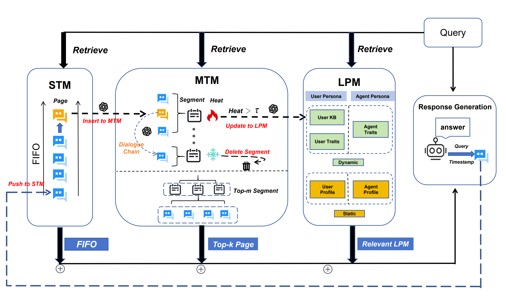
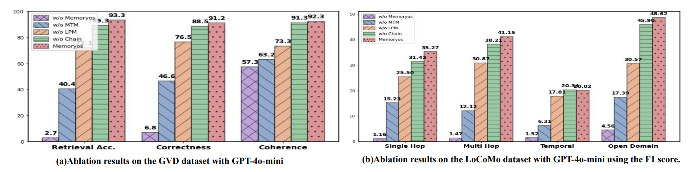
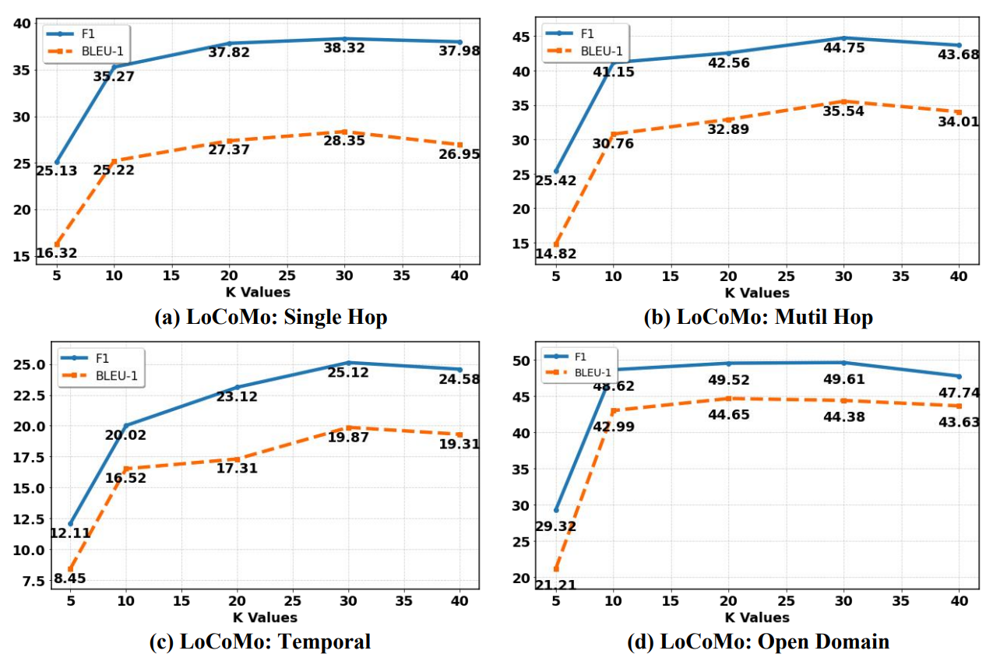

# Memory OS of AI Agent

> 原文：https://arxiv.org/pdf/2506.06326

## 摘要

大语言模型（LLMs）面临固定上下文窗口和内存管理不足的关键挑战，导致长期记忆能力严重缺乏，并在与 AI 代理的交互体验中个性化程度有限。为克服这一挑战，我们创新性地提出了一种记忆操作系统，即 MemoryOS，以实现 AI 代理的全面高效记忆管理。MemoryOS 受操作系统中的记忆管理原理启发，设计了分层存储架构，包含四个关键模块：记忆存储、记忆更新、记忆检索和记忆生成。具体而言，该架构包含三个存储层级：短期记忆、中期记忆和长期个人记忆。MemoryOS 中的关键操作包括存储单元之间的动态更新：短期到中期的更新遵循基于对话链的 FIFO 原则，而中期到长期的更新使用段页式存储管理策略。我们的开创性 MemoryOS 实现了分层记忆整合和动态更新。在 LoCoMo 基准测试上的大量实验表明，在 GPT-4o-mini 上相比基线模型，F1 提升 49.11%，BLEU-1 提升 46.18%，展示了在长对话中的上下文一致性和个性化记忆保留。该实现代码已在 [GitHub](https://github.com/BAI-LAB/MemoryOS) 上开源。

## 1. 引言

大语言模型（LLMs）在文本理解和生成方面展现出令人印象深刻的能力，但由于依赖固定长度的上下文窗口进行记忆管理，在维持对话一致性方面面临固有的局限性。这种固定长度设计在与具有显著时间间隔的对话中难以保持连贯性，往往导致记忆碎片化，表现为事实不一致和个性化降低。长期记忆一致性在需要持续用户适应、多会话知识保留或跨扩展交互的稳定 persona 表现的场景中至关重要，LLM 默认设置中固定长度记忆管理的局限性变得尤为突出，构成了该领域的一个重要开放挑战。

为解决这一挑战，当前默认 LLM 中的记忆机制可分为三类方法：（1）知识组织方法，如 A-Mem 将记忆组织为互联的语义网络或笔记，以实现自适应管理和灵活检索；（2）检索机制导向方法，例如 MemoryBank 将语义检索与记忆遗忘曲线机制相结合，允许长期记忆更新；（3）架构驱动方法，如 MemGPT 使用分层结构和显式读写操作来动态管理上下文。尽管这些多样化策略通常独立运作，即各自聚焦于存储结构、检索机制或更新策略等单一维度，但目前尚未提出统一的操作系统来为 AI 代理实现系统化、全面化的记忆管理。

受操作系统中记忆管理原理的启发，我们开创性地提出了一种全面的记忆操作系统，称为 MemoryOS。MemoryOS 由四个核心功能模块组成：记忆存储、记忆更新、记忆检索和记忆生成。通过它们的协调合作，该系统建立了统一的记忆管理框架，涵盖分层存储、动态更新、自适应检索和上下文生成。具体而言，记忆存储将信息组织为短期、中期和长期存储单元。记忆更新通过基于对话链的分段页面架构和基于热度的机制动态刷新。记忆检索利用语义分割查询这些层级，然后响应生成整合检索到的记忆信息，生成连贯且个性化的响应。这种协同工作流程确保了长期对话记忆的整体管理，使扩展对话中的上下文一致性和个性化召回成为可能。本工作的主要贡献总结如下：

- 我们首次创新性地引入了一种称为 MemoryOS 的系统化操作系统用于记忆管理，赋予 AI 代理在长对话交互中长期对话一致性和用户 persona 持久性的能力。

- MemoryOS 引入了一种开创性的三层分层记忆存储架构，并集成了四个核心功能模块（即存储、更新、检索和生成）用于记忆管理，能够在扩展对话中动态捕捉和演化用户偏好。

- 综合实验验证了 MemoryOS 在维持跨不同基准数据集的响应正确性和一致性方面的有效性和效率，展示了其处理长对话交互的能力。

## 2. 相关工作

### 2.1 LLM 代理的记忆

现有的大语言模型（LLMs）在处理需要长期一致性的复杂场景时面临根本性挑战。这些挑战源于固定长度设计的固有局限性，难以在与显著时间间隔的对话中保持连贯性，导致记忆碎片化，表现为事实不一致和个性化降低。解决这一问题的 LLM 记忆系统进展可分为三类：知识组织、检索机制导向和架构驱动框架。知识组织方法专注于捕捉和构建大语言模型的中间推理状态。例如，Think-in-Memory（TiM）存储不断演化的思维链，通过持续更新实现一致性。A-Mem 将知识组织成跨会话的互联笔记网络。Grounded Memory 集成视觉-语言模型进行感知，知识图谱用于结构化记忆表示，以实现智能个人助理中的上下文感知推理。检索机制导向方法通过外部记忆库丰富模型。MemoryBank 在向量数据库中记录对话、事件和用户特征，并使用遗忘曲线调度进行刷新；AI-town 以自然语言保存记忆，并添加反思循环进行相关性过滤。EmotionalRAG 通过语义相似性与代理当前情绪状态相结合的混合策略检索记忆条目。架构驱动设计改变核心控制流以显式管理上下文。例如，MemGPT 采用类 OS 的分层结构和专用读写调用，而自控制记忆（SCM）引入双缓冲区和记忆控制器来控制选择性召回。

### 2.2 操作系统中的内存管理

现代操作系统（OS）使用组合段页内存管理来平衡逻辑结构与高效物理利用。Multics 等经典方法将内存组织成划分为页面的段，支持高效的管理、保护和共享。段元数据（大小、访问权限）防止外部碎片化，而分页减少了内部碎片化。高级 OS 使用基于优先级的驱逐策略（如 LRU、工作集模型）来维护热数据，Zheng 等人表明将粗粒度分段与细粒度分页相结合可减少多核处理器的开销。

*图 1：MemoryOS 的整体架构，包括记忆存储（Store）、更新（Updating）、检索（Retrieval）和响应（Response）。*

受 OS 中管理的启发，我们的 MemoryOS 通过将其记忆构建成逻辑段（对话主题）细分为页面来应用这些原理。它使用基于热度的优先级来保留相关内容，高效地丢弃或归档访问较少的信息，增强上下文管理和个性化。

## 3. MemoryOS

MemoryOS 是一个为 AI 代理设计的全面记忆管理系统，动态更新记忆并检索语义相关的上下文，确保在长对话中实现连贯和个性化的交互。

### 3.1 架构概述

MemoryOS 的概述架构由四个模块组成：记忆存储、更新、检索和生成。

**记忆存储**：该模块负责通过三层分层结构组织和存储记忆信息：短期记忆（STM）用于及时对话，中期记忆（MTM）用于重复主题摘要，长期个人记忆（LPM）用于用户或代理偏好，确保记忆完整性和有效利用。

**记忆更新**：该模块管理动态记忆刷新，包括通过对话链 FIFO 从 STM 到 MTM 的更新，以及使用基于热度的分段页面替换策略从 MTM 到 LPM 的更新。

**记忆检索**：该模块通过特定查询检索相关记忆，在 MTM 中采用两层级方法：语义相关性首先识别段，然后在段内检索相关对话页面。最后，它结合来自 LPM 的 persona 属性和来自 STM 的上下文信息来生成响应，整合所有相关记忆以进行响应生成。

**响应生成**：处理数据并生成适当的响应。它将来自 STM、MTM 和 LPM 的检索结果整合成一个连贯的提示，使能够生成上下文一致和个性化的响应。

### 3.2 记忆存储模块

记忆存储模块通过由三种类型存储单元组成的分层结构实现，即短期记忆（STM）、中期记忆（MTM）和长期个人记忆（LPM）存储单元。

**短期记忆（STM）**：它以对话页面为单位存储实时对话数据。每个对话页面包含用户查询 Q、模型响应 R 和时间戳 T，结构化为 $page_i = \{Q_i, R_i, T_i\}$ 。为确保上下文一致性，为每个页面构建对话链以维护短期连续对话交换中的上下文信息，并确保一致的上下文跟踪。对话页面定义为： 

公式 1：$page_i^{chain} = \{Q_i, R_i, T_i, meta_i^{chain}\}$ ，

其中元信息由 LLM 分两步生成：首先，评估新页面对先前页面的上下文相关性，以确定链链接或如果语义不连续则重置到当前页面；其次，总结所有链页面为 $meta_i^{chain}$。

**中期记忆（MTM）**：受操作系统中的记忆管理原理启发，它采用分段分页存储架构。具有相同主题的对话页面被分组为段，每个段包含多个属于唯一主题的页面。MTM 中的段定义为：

公式 2：$segment_i = \{page_i | F_{score}(page_i, segment_i) > \theta\}$，

其中段的内容由 LLM 基于相关对话页面进行摘要。$F_{score}$ 测量对话页面和段之间的相似性，基于语义和关键词相似性，定义为：

公式 3：$F_{score} = cos(e_s, e_p) + F_{Jaccard}(K_s, K_p)$，

其中 $e_s$ 和 $e_p$ 分别表示段和对话页面的嵌入向量，$K_s$ 和 $K_p$ 分别是段和页面中由 LLM 摘要的关键词集。$F_{Jaccard}$ 是 Jaccard 相似度 ，定义为 $F_{Jaccard} = \frac{|K_s \cap K_p|}{|K_s \cup K_p|}$。与段的相似度得分超过阈值 θ 的页面被合并到同一段中，确保段内的话题一致性和语义一致性。

**长期 Persona 记忆（LPM）**：该模块确保用户和助手都保持对重要个人细节和特征的持久记忆，确保长期交互的一致性和个性化。它由两个组件组成：用户 Persona 和 AI 代理 Persona。

- **用户 Persona**：**User Profile** 包含固定属性的静态组件（性别、姓名、出生年份）、User Knowledge
Base（ **User KB** ），动态存储从过去交互中提取和增量更新的事实信息，以及用户特征，包含用户随时间演变的兴趣、习惯和偏好。

- **代理 Persona**：它包含代理档案，包括固定设置，如 AI 代理助手扮演的角色或其角色特征，提供一致的自我描述。代理特征是随用户交互而发展的动态属性，可能包括用户在对话中添加的新设置或交互历史，例如推荐项目。

### 3.3 记忆更新模块

关键更新操作包括每个单元内部的更新以及从 STM 到 MTM、MTM 到 LPM 存储单元的更新机制。

**STM-MTM 更新**：STM 以固定长度的队列形式存储信息（以对话页面为单位）。我们采用先进先出（FIFO）更新策略将信息迁移到中期记忆（MTM）。新的对话页面追加到队列末尾。当 STM 队列达到最大容量时，按照 FIFO 原则将最旧的对话页面从 STM 转移到 MTM。

**MTM-LPM 更新**：MTM 更新涉及两个操作，即段删除和段到 LPM 的更新，两者都基于段的热度得分，定义为：

公式 4：$Heat = \alpha \cdot N_{visit} + \beta \cdot L_{interaction} + \gamma \cdot R_{recency}$，

其中系数 α、β 和 γ 决定每个因素的相对重要性。$N_{visit}$ 是段被检索的次数，$L_{interaction}$ 表示段内的对话页面总数，$R_{recency}$ 是时间衰减系数，表示当前段自上次检索时间以来的持续时间，定义为：$R_{recency} = \exp(-\Delta t / \mu)$

其中 Δt 是自上次访问以来经过的时间（以秒为单位），μ 是可配置的时间常数（即 1e+7）。这三个指标，即检索次数（$N_{visit}$）、对话页面总数（$L_{interaction}$）和时间衰减系数（$R_{recency}$），共同代表高频访问、高参与度和最近使用作为段热度的核心指标。当段长度超过最大容量时，热度最低的段被驱逐。该机制确保存储在 MTM 中的内容能够保留在用户长对话中高参与度的话题，通过分段页面结构保留这些话题下的详细对话内容。

**LPM 更新**：热度超过阈值 τ（即 5）的段被转移到 LPM。段及其对话页面更新用户特征、用户 KB 和代理特征。按照 Li 等人的用户特征方法，我们用三个类别构建 90 维个性化用户特征：基本需求和人格、AI 对齐维度以及内容平台兴趣标签。然后，从段和对话页面中提取和更新这些维度，由 LLM 自主演化特征。同时，提取与用户和代理助手相关的事实信息并分别记录到用户 KB 和代理特征。用户 KB 和助手特征都维护固定大小的队列（即 100），采用先进先出（FIFO）策略。记忆转移后，公式 4 中的页面数 $L_{interaction}$ 重置为零，导致段的热度得分下降。这确保了持续的 persona 演化且无冗余。

### 3.4 记忆检索模块

记忆检索模块从三部分检索信息：STM 用于最近上下文，MTM 使用两阶段检索（段和页面级别），LPM 用于个性化知识。给定用户的查询，记忆检索模块从存储的记忆中检索，即 STM、MTM 和 LPM，返回最相关信息以生成响应，定义为：

公式 5：$F_{Retrieval}(STM, MTM, LPM \mid Q)$，

其中 $F_{Retrieval}$ 是应用于三个记忆存储单元的检索策略。

**STM 检索**：由于 STM 持有当前对话最近的上下文记忆，因此检索所有对话页面。

**MTM 检索**：受心理学记忆召回机制启发，采用两阶段检索过程：首先通过匹配分数（公式 3 中定义）选择前 m 个候选段，然后基于语义相似性在这些段内选择前 k 个最相关的对话页面。检索后，更新段的访问计数器 $N_{visit}$ 和时间因子 $R_{recency}$。

**LPM 检索**：用户 KB 和助手特征各自检索与查询向量语义相关性最高的前 10 个条目作为背景知识。利用用户档案、代理档案和用户特征中的所有信息，因为它们存储用户偏好信息、代理特征信息和用户特定特征信息。

### 3.5 响应生成模块

给定用户查询，最终提示通过将上述三种类型的检索内容（来自 STM、MTM 和 LPM）与用户的查询整合形成，作为 LLM 生成最终响应的最终提示输入。整合来自最近对话（STM）的记忆、相关对话页面（MTM）和 persona 信息（LPM）确保响应与当前交互保持上下文一致，从历史对话细节和摘要中汲取深度，并与用户和助手身份保持一致，实现 AI 代理系统连贯、准确和个性化的交互体验。

## 4. 实验

### 4.1 实验设置

**数据集**：我们在 GVD 和 LoCoMo 基准数据集上进行实验。GVD 数据集由 15 个虚拟用户与助手在 10 天期间交互模拟的多轮对话组成，每天至少涵盖两个话题。LoCoMo 基准专门设计用于评估长期对话记忆能力，由平均 300 轮和约 9K token 的超长对话组成。问题分为四种类型：单跳、多跳、时间顺序和开放域，系统评估 LLMs 的记忆能力。

**评估指标**：对于 GVD 数据集，我们使用三个评估指标：记忆检索准确率（Acc.）、响应正确性（Corr.）和上下文一致性（Cohe.）。记忆检索准确率评估为二元指标（0 或 1），而正确性和一致性以三分制评估（0、0.5 或 1）。GVD 数据集上的所有评估由 DeepSeek-R1 自动评分。在 LoCoMo 基准上，采用标准 F1 和 BLEU-1 来评估模型性能。

**比较方法**：我们将 MemoryOS 与代表性记忆方法进行比较，包括：

- **TiM（Think-in-Memory）**：该方法通过存储推理结果而非原始对话来模拟人类记忆。它使用局部敏感哈希（LSH）在生成响应前检索相关上下文，并通过事后反思更新记忆。TiM 通过插入、遗忘和合并来管理记忆，以减少冗余推理并提高一致性。

- **MemoryBank**：该框架基于艾宾浩斯遗忘曲线动态调整记忆强度，随时间优先处理重要内容。它通过持续交互分析进一步构建用户画像，以支持个性化响应。

- **MemGPT**：该方法引入双层记忆，特点是用于快速访问的主上下文和用于长期存储的外部上下文。该设计旨在实现超出 LLMs 固定上下文窗口的可扩展记忆扩展。

- **A-Mem（Agentic Memory）**：它动态生成结构化笔记并将其链接形成互联知识网络，实现 LLMs 的持续记忆演化和自适应管理。

- **MemoryOS**：这是一个全面的记忆管理框架。通过与四个核心功能模块的协调合作：记忆存储、更新、检索和生成。MemoryOS 在长交互中实现对话一致性和用户 persona 持久性。

*表 1：在 GVD 数据集上的对比结果。*

<table style="border-collapse: collapse; width: 100%; text-align: center;">
  <thead>
    <tr style="border-top: 3px solid black; border-bottom: 2px solid black;">
      <th style="padding: 8px; text-align: center;">Model</th>
      <th style="padding: 8px; text-align: center;">Method</th>
      <th style="padding: 8px; text-align: center;">Acc. ↑</th>
      <th style="padding: 8px; text-align: center;">Corr. ↑</th>
      <th style="padding: 8px; text-align: center;">Cohe. ↑</th>
    </tr>
  </thead>

  <tbody>
    <tr>
      <td rowspan="5" style="padding: 8px; vertical-align: middle;">GPT-4o-mini</td>
      <td>TiM</td>
      <td>84.5</td>
      <td>78.8</td>
      <td>90.8</td>
    </tr>
    <tr>
      <td>MemoryBank</td>
      <td>78.4</td>
      <td>73.3</td>
      <td>91.2</td>
    </tr>
    <tr>
      <td>MemGPT</td>
      <td>87.9</td>
      <td>83.2</td>
      <td>89.6</td>
    </tr>
    <tr>
      <td>A-Mem</td>
      <td><u>90.4</u></td>
      <td><u>86.5</u></td>
      <td><u>91.4</u></td>
    </tr>
    <tr style="font-weight: bold;">
      <td>Ours</td>
      <td>93.3</td>
      <td>91.2</td>
      <td>92.3</td>
    </tr>
    <tr style="border-top: 2px solid black; border-bottom: 2px solid black;">
      <td colspan="2" style="padding: 8px;">Improvement (%)</td>
      <td>3.2% ↑</td>
      <td>5.4% ↑</td>
      <td>1.0% ↑</td>
    </tr>
    <tr><td colspan="5" style="height: 10px;"></td></tr>
    <tr>
      <td rowspan="5" style="padding: 8px; vertical-align: middle;">Qwen2.5-7B</td>
      <td>TiM</td>
      <td>82.2</td>
      <td>73.2</td>
      <td>85.5</td>
    </tr>
    <tr>
      <td>MemoryBank</td>
      <td>76.3</td>
      <td>70.3</td>
      <td>82.7</td>
    </tr>
    <tr>
      <td>MemGPT</td>
      <td>85.1</td>
      <td>80.2</td>
      <td>86.9</td>
    </tr>
    <tr>
      <td>A-Mem</td>
      <td><u>87.2</u></td>
      <td><u>79.5</u></td>
      <td><u>87.8</u></td>
    </tr>
    <tr style="font-weight: bold;">
      <td>Ours</td>
      <td>91.8</td>
      <td>82.3</td>
      <td>90.5</td>
    </tr>
    <tr style="border-top: 2px solid black; border-bottom: 3px solid black;">
      <td colspan="2" style="padding: 8px;">Improvement (%)</td>
      <td>5.3% ↑</td>
      <td>3.5% ↑</td>
      <td>3.1% ↑</td>
    </tr>
  </tbody>
</table>

**实现细节**：实验在配备 8 个 H20 GPU 的硬件上进行。STM 中对话页面队列的固定长度为 7。MTM 中段的最大长度设置为 200。用户 KB 和代理特征的最大容量都设置为 100 个条目。预定义的热度阈值 τ，控制从 MTM 到 LPM 的信息，设置为 5。公式 4 中 α、β 和 γ 的值相等设置为 1。对于记忆检索，检索的前 m 段数设置为 5，在 GVD 和 LoCoMo 数据集上，检索对话页面的超参数 top-k 分别设置为 5 和 10。公式 2 中 θ 的相似度值为 0.6，时间常数 μ 为 1e+7。

### 4.2 主要结果

*表 2：LoCoMo 数据集上的对比结果，包括各类别得分及平均排名。A-Mem 表示原论文中报告的结果，A-Mem* 表示我们在与本文模型相同实验环境下复现得到的结果。*

<table style="border-collapse: collapse; width: 100%; text-align: center;">
  <thead>
    <tr style="border-top: 3px solid black; border-bottom: 2px solid black;">
      <th rowspan="2" style="padding: 8px;">Model</th>
      <th rowspan="2" style="padding: 8px;">Method</th>
      <th colspan="2" style="padding: 8px;">Single Hop</th>
      <th colspan="2" style="padding: 8px;">Multi Hop</th>
      <th colspan="2" style="padding: 8px;">Temporal</th>
      <th colspan="2" style="padding: 8px;">Open Domain</th>
      <th rowspan="2" style="padding: 8px;">Avg. Rank ↓ (F1)</th>
      <th rowspan="2" style="padding: 8px;">Avg. Rank ↓ (BLEU-1)</th>
    </tr>
    <tr style="border-bottom: 2px solid black;">
      <th>F1 ↑</th>
      <th>BLEU-1 ↑</th>
      <th>F1 ↑</th>
      <th>BLEU-1 ↑</th>
      <th>F1 ↑</th>
      <th>BLEU-1 ↑</th>
      <th>F1 ↑</th>
      <th>BLEU-1 ↑</th>
    </tr>
  </thead>
  <tbody>
    <!-- GPT-4o-mini -->
    <tr>
      <td rowspan="6" style="vertical-align: middle;">GPT-4o-mini</td>
      <td>TiM</td>
      <td>16.25</td><td>13.12</td>
      <td>18.43</td><td>17.35</td>
      <td>8.35</td><td>7.32</td>
      <td>23.74</td><td>22.05</td>
      <td>3.8</td><td>4.0</td>
    </tr>
    <tr>
      <td>MemoryBank</td>
      <td>5.00</td><td>4.77</td>
      <td>9.68</td><td>6.99</td>
      <td>5.56</td><td>5.94</td>
      <td>6.61</td><td>5.16</td>
      <td>5.0</td><td>5.0</td>
    </tr>
    <tr>
      <td>MemGPT</td>
      <td>26.65</td><td>17.72</td>
      <td>25.52</td><td>19.44</td>
      <td>9.15</td><td>7.44</td>
      <td>41.04</td><td>34.34</td>
      <td>2.2</td><td>2.5</td>
    </tr>
    <tr>
      <td>A-Mem</td>
      <td><u>27.02</u></td><td><u>20.09</u></td>
      <td><strong>45.85</strong></td><td><strong>36.67</strong></td>
      <td>12.14</td><td>12.00</td>
      <td><u>44.65</u></td><td><u>37.06</u></td>
      <td>–</td><td>–</td>
    </tr>
    <tr>
      <td>A-Mem*</td>
      <td>22.61</td><td>15.25</td>
      <td>33.23</td><td>29.11</td>
      <td>8.04</td><td>7.81</td>
      <td>34.13</td><td>27.73</td>
      <td>3.0</td><td>2.5</td>
    </tr>
    <tr style="font-weight: bold;">
      <td>Ours</td>
      <td>35.27</td><td>25.22</td>
      <td>41.15</td><td>30.76</td>
      <td>20.02</td><td>16.52</td>
      <td>48.62</td><td>42.99</td>
      <td>1.0</td><td>1.0</td>
    </tr>
    <tr style="border-top: 2px solid black; border-bottom: 2px solid black;">
      <td colspan="2">Improvement (%)</td>
      <td>32.35%↑</td><td>42.33%↑</td>
      <td>23.83%↑</td><td>5.67%↑</td>
      <td>118.80%↑</td><td>111.52%↑</td>
      <td>18.47%↑</td><td>25.19%↑</td>
      <td>–</td><td>–</td>
    </tr>
    <!-- spacer -->
    <tr><td colspan="12" style="height: 10px;"></td></tr>
    <!-- Qwen2.5-3B -->
    <tr>
      <td rowspan="6" style="vertical-align: middle;">Qwen2.5-3B</td>
      <td>TiM</td>
      <td>4.37</td><td>5.01</td>
      <td>2.54</td><td>3.21</td>
      <td>6.20</td><td>5.37</td>
      <td>6.35</td><td>7.34</td>
      <td>4.3</td><td>3.5</td>
    </tr>
    <tr>
      <td>MemoryBank</td>
      <td>3.60</td><td>3.39</td>
      <td>1.72</td><td>1.97</td>
      <td>6.63</td><td>6.58</td>
      <td>4.11</td><td>3.32</td>
      <td>4.8</td><td>4.8</td>
    </tr>
    <tr>
      <td>MemGPT</td>
      <td>5.07</td><td>4.31</td>
      <td>2.94</td><td>2.95</td>
      <td>7.04</td><td>7.10</td>
      <td>7.26</td><td>5.52</td>
      <td>2.8</td><td>3.8</td>
    </tr>
    <tr>
      <td>A-Mem</td>
      <td><u>12.57</u></td><td><u>9.01</u></td>
      <td><strong>27.59</strong></td><td><strong>25.07</strong></td>
      <td><u>7.12</u></td><td><u>7.28</u></td>
      <td><u>17.23</u></td><td><u>13.12</u></td>
      <td>–</td><td>–</td>
    </tr>
    <tr>
      <td>A-Mem*</td>
      <td>10.31</td><td>8.76</td>
      <td>16.31</td><td>11.07</td>
      <td>6.94</td><td>7.31</td>
      <td>12.34</td><td>10.62</td>
      <td>2.3</td><td>2.0</td>
    </tr>
    <tr style="font-weight: bold;">
      <td>Ours</td>
      <td>23.26</td><td>15.39</td>
      <td>21.44</td><td>14.95</td>
      <td>10.18</td><td>8.18</td>
      <td>26.23</td><td>22.39</td>
      <td>1.0</td><td>1.0</td>
    </tr>
    <tr style="border-top: 2px solid black; border-bottom: 3px solid black;">
      <td colspan="2">Improvement (%)</td>
      <td>125.61% ↑</td><td>75.68% ↑</td>
      <td>31.45% ↑</td><td>35.05% ↑</td>
      <td>46.69% ↑</td><td>11.90% ↑</td>
      <td>112.56% ↑</td><td>110.83% ↑</td>
      <td>–</td><td>–</td>
    </tr>
  </tbody>
</table>

*图2：在 GVD 和 LoCoMo 基准数据集上的消融实验研究。*

*表3：在 LoCoMo 基准上的效率分析（以 LLM 调用次数和召回 token 数量进行量化）。*

| Method     | Tokens | Avg. Calls | Avg. F1 |
| ---------- | ------ | ---------- | ------- |
| MemoryBank | 432    | 3.0        | 6.84    |
| TiM        | 1,274  | 2.6        | 18.01   |
| MemGPT     | 16,977 | 4.3        | 29.13   |
| A-Mem*     | 2,712  | 13.0       | 26.55   |
| **Ours**       | **3,874**  | **4.9**        | **36.23**   |

*图3：超参数 k（MTM 中检索到的页面数）对 LoCoMo 基准的影响。*

GVD 和 LoCoMo 基准数据集的实验结果表明：

（1）在所有记忆方法中，MemoryBank 表现最差。这表明简单应用记忆衰减机制不足以有效管理对话记忆。TiM 通过保存"思考"而非原始对话轮次来减轻重复推理，表现优于 MemoryBank，但其单阶段哈希检索无法保留跨话题依赖关系。

（2）A-Mem 和 MemGPT 在长对话中表现出相对较强的性能。但两者都缺乏系统化的记忆管理机制，会导致某些问题。例如，MemGPT 通过 OS 风格的分页扩展上下文，但其扁平的 FIFO 队列导致随着对话长度增加话题混合；A-Mem 将记忆组织成图结构，丰富了语义，但繁重、多步的链接生成会增加延迟和错误累积。相比之下，我们的 Memory OS 通过分段分页与基于热度的驱逐和 persona 模块融合了分层 STM/MTM/LPM 架构，从而确保话题对齐的内容保持可访问性，同时保持与用户特定偏好的一致性。

（3）我们提出的 MemoryOS 在所有基准数据集上实现了卓越性能，这归功于其分层存储设计、语义检索能力和 persona 驱动的动态更新，确保了连贯和准确的记忆管理。值得注意的是，模型的优势在更具挑战性的记忆管理任务中尤为明显。例如，在使用 gpt-4o-mini 的 LoCoMo 基准上，F1 得分平均提升 49.11%，BLEU-1 提升 46.18%，而在较简单的 GVD 数据集上（所有方法都获得更高的基线准确率），我们的 MemoryOS 仍以 3.2% 的准确率超过 SOTA 基线 A-Mem，展示了在需要语义一致性的复杂长上下文任务中的稳健处理能力。

（4）为评估模型效率，我们采用两个指标：消耗的 token 数（记忆检索中）和每次响应的平均 LLM 调用次数。我们的方法在两个方面都优于 Top-2 基线（即 MemGPT 和 A-Mem），与 A-Mem* 相比需要的 LLM 调用次数显著更少（4.9 vs. 13），与 MemGPT 相比 token 消耗也低得多（3,874 vs. 16,977）。

### 4.3 消融研究

为评估我们框架中每个核心模块的贡献，我们通过单独移除三个关键组件进行消融研究：中期记忆（-MTM）、长期 Persona 模块（-LPM）和对话页面链（-Chain）以及整个记忆系统（-MemoryOS）。结果表明，在长对话中，记忆系统在响应质量中起着关键作用。没有 MemoryOS，模型性能大幅下降。在 MemoryOS 中，中期记忆（MTM）影响最大，其次是长期记忆（LPM），而链的影响最小。

### 4.4 超参数分析

我们分析了从中型记忆（MTM）检索的前 $k$ 个对话页面对模型性能的影响。通过在 LoCoMo 基准上将超参数 $k$ 设置为不同值 $k = \{5, 10, 20, 30, 40\}$，可以看到模型性能随着 $k$ 增加而提升，但超过阈值后提升减弱。检索更多页面可以提高模型性能，但过多内容可能引入噪声，对性能产生不利影响。我们设置 $k = 10$ 以在最小化计算开销的同时实现相对较好的性能。

### 4.5 案例研究

为直观展示我们记忆系统的作用，特别是用户长期记忆维护如何增强对话一致性。我们呈现了默认 LLMs 和我们的配备 MemoryOS 的 LLMs 的响应案例研究。我们可以看到 MemoryOS 在召回用户长期对话和偏好方面表现出色。例如，MemoryOS 从最初提到的"我去了湿地公园……"中召回几周前的细节，如"看风景、跑步和在湿地公园发现松鼠"。这些细节通过中型记忆的分段页面存储与对话页面链的相互作用和相互支持来检索。此外，由于系统集成了个性化模块，它可以记住用户"想要健身"的目标，并在用户表示想吃汉堡时主动提醒用户："别忘了你想减肥"。这凸显了记忆模块在增强对话一致性和用户体验中的关键作用。

## 5. 结论

受操作系统中记忆管理机制的启发，我们开创性地提出了一种用于 AI 代理的新型记忆管理系统 MemoryOS。通过分层记忆存储架构实现，MemoryOS 解决了长对话中固定上下文窗口的局限性。通过为对话历史采用 OS 风格的分段分页存储，MemoryOS 使用热度驱动的驱逐来实现高效的记忆存储、更新和语义检索，动态优先处理跨记忆层级的关键信息。集成的 persona 模块通过个性化特征提取捕捉演化中的用户偏好，确保响应符合长对话上下文。通过将 OS 原理与 AI 记忆管理相结合，MemoryOS 赋能 LLMs 在扩展交互中维持连贯、个性化的对话，增强现实世界应用中的类人对话能力。

## 参考文献

- Bensoussan, A., Clingen, C. T., and Daley, R. C. (1972). The multics virtual memory: Concepts and design. *Communications of the ACM*, 15(5):308–318.

- Chhikara, P., Khant, D., Aryan, S., Singh, T., and Yadav, D. (2025). [Mem0: Building production-ready AI agents with scalable long-term memory](https://arxiv.org/abs/2504.19413). arXiv:2504.19413.

- DeepSeek-AI et al. (2025). [DeepSeek-R1: Incentivizing reasoning capability in LLMs via reinforcement learning](https://arxiv.org/abs/2501.12948). arXiv:2501.12948.

- Denning, P. J. (1970). Virtual memory. *ACM Computing Surveys*, 2(3):153–189.

- Du, Y., Huang, W., Zheng, D., Wang, Z., Montella, S., Lapata, M., Wong, K.-F., and Pan, J. Z. (2025). [Rethinking memory in AI: Taxonomy, operations, topics, and future directions](https://arxiv.org/abs/2505.00675). arXiv:2505.00675.

- Huang, L., Lan, H., Sun, Z., Shi, C., and Bai, T. (2024). [Emotional RAG: Enhancing role-playing agents through emotional retrieval](https://doi.org/10.1109/ICKG63256.2024.00023). In *2024 IEEE International Conference on Knowledge Graph (ICKG)*, pages 120–127.

- Li, H., Yang, C., Zhang, A., Deng, Y., Wang, X., and Chua, T.-S. (2024). [Hello again! LLM-powered personalized agent for long-term dialogue](https://arxiv.org/abs/2406.05925). arXiv:2406.05925.

- Li, J.-N., Guan, J., Wu, S., Wu, W., and Yan, R. (2025). [From 1,000,000 users to every user: Scaling up personalized preference for user-level alignment](https://arxiv.org/abs/2503.15463). arXiv:2503.15463.

- Liu, L., Yang, X., Shen, Y., Hu, B., Zhang, Z., Gu, J., and Zhang, G. (2023). [Think-in-Memory: Recalling and post-thinking enable LLMs with long-term memory](https://arxiv.org/abs/2311.08719). arXiv:2311.08719.

- Maharana, A., Lee, D.-H., Tulyakov, S., Bansal, M., Barbieri, F., and Fang, Y. (2024). [Evaluating very long-term conversational memory of LLM agents](https://doi.org/10.18653/v1/2024.acl-long.747). In *Proceedings of the 62nd Annual Meeting of the Association for Computational Linguistics (Volume 1: Long Papers)*, pages 13851–13870, Bangkok, Thailand.

- Ocker, F., Deigmöller, J., Smirnov, P., and Eggert, J. (2025). [A grounded memory system for smart personal assistants](https://arxiv.org/abs/2505.06328). arXiv:2505.06328.

- Packer, C., Fang, V., Patil, S. G., Lin, K., Wooders, S., and Gonzalez, J. E. (2023). [MemGPT: Towards LLMs as operating systems](https://github.com/KnowingSarah/MemGPT).

- Papineni, K., Roukos, S., Ward, T., and Zhu, W.-J. (2002). Bleu: A method for automatic evaluation of machine translation. In *Proceedings of the 40th Annual Meeting of the Association for Computational Linguistics*, pages 311–318.

- Park, J. S., O'Brien, J., Cai, C. J., Morris, M. R., Liang, P., and Bernstein, M. S. (2023). Generative agents: Interactive simulacra of human behavior. In *Proceedings of the 36th Annual ACM Symposium on User Interface Software and Technology*, pages 1–22.

- Wang, B., Liang, X., Yang, J., Huang, H., Wu, S., Wu, P., Lu, L., Ma, Z., and Li, Z. (2025). [SCM: Enhancing large language model with self-controlled memory framework](https://arxiv.org/abs/2304.13343). arXiv:2304.13343.

- Wu, Y., Liang, S., Zhang, C., Wang, Y., Zhang, Y., Guo, H., Tang, R., and Liu, Y. (2025). [From human memory to AI memory: A survey on memory mechanisms in the era of LLMs](https://arxiv.org/abs/2504.15965). arXiv:2504.15965.

- Xu, W., Liang, Z., Mei, K., Gao, H., Tan, J., and Zhang, Y. (2025). [A-Mem: Agentic memory for LLM agents](https://arxiv.org/abs/2502.12110). arXiv:2502.12110.

- Yuan, P., Wang, X., Feng, S., Pan, B., Li, Y., Wang, H., Miao, X., and Li, K. (2024). Generative dense retrieval: Memory can be a burden. In *Proceedings of the 18th Conference of the European Chapter of the Association for Computational Linguistics (Volume 1: Long Papers)*, St. Julian's, Malta.

- Zhang, Z., Bo, X., Ma, C., Li, R., Chen, X., Dai, Q., Zhu, J., Dong, Z., and Wen, J.-R. (2024). [A survey on the memory mechanism of large language model-based agents](https://arxiv.org/abs/2404.13501). arXiv:2404.13501.

- Zheng, Y., Zou, T., and Wang, X. (2020). Segment-page-combined memory management technology based on a homegrown many-core processor. *CCF Transactions on High Performance Computing*, 2(4):376–381.

- Zhong, W., Guo, L., Gao, Q., Ye, H., and Wang, Y. (2024). [MemoryBank: Enhancing large language models with long-term memory](https://ojs.aaai.org/index.php/AAAI/article/view/31353). In *Proceedings of the AAAI Conference on Artificial Intelligence*, volume 38, pages 19724–19731.